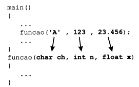
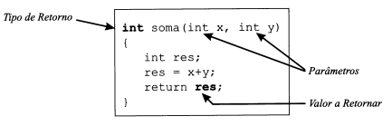
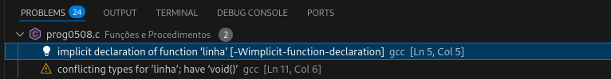

# Linguagem C

## Funções e Procedimentos

Embora ainda sem saber como escrever uma função, já as temos utilizado ao longo dos nossos programas. São exemplos as funções *printf*, *scanf*, *getchar*, *putchar*, *ect.,* que fazem parte da biblioteca *standard* de C e nos são fornecidas quando adquirimos qualquer compilador de C.

Neste capítulo vamos aprender como escrever funções e procedimentos, como passar parâmetros e como devolver algum valor como resultado de uma função.

É absolutamente indispensável que um programador de C domine completamente a escrita de programas de forma modular, através de procedimentos e funções.

**Problema:** Escreva um programa que coloque na tela a seguinte saída, escrevendo a linha de 20 asteristicos de forma modular, através de um laço for.

    *******************
    Números entre 1 e 5
    *******************
    1
    2
    3
    4
    5
    *******************

***prog0501.c***

```C
#include <stdio.h>

int main()
{
    int i;

    /* Escrita do Cabeçalho */

    for (i = 1; i <= 20; i++)
        putchar('*');
    putchar('\n');

    puts("Números entre 1 e 5");

    for (i = 1; i <= 20; i++)
        putchar('*');
    putchar('\n');

    /* Escrita dos N°s */

    for (i = 1; i <= 5; i++)
        printf("%d\n", i);
        
    for (i = 1; i <= 20; i++)
        putchar('*');
    putchar('\n');

}
```

Como se pode observar, o conjunto de código utilizado para escrever um linha  de asteriscos na tela

    for (i=1; i<=20; i++)
        putchar('*');
    putchar('\n');

aparece repetido três vezes. O ideal seria escrever esse trecho de código apenas uma única vez e invocá-lo sempre que necessário. A solução é dividir o programa em pequenos fragmentos de código, cada um dos quais é responsável por uma determinada tarefa.

**Problema:** Escreva um programa que coloque uma linha com 20 asteriscos na tela.

***prog0502.c***

```C

#include <stdio.h>

main()
{
    int i;
    for (i=1; i<=20; i++)
        putchar('*');
    putchar('\n');
}
```

O programa anterior coloca na tela uma linha com 20 asteriscos. Foi implementado como sendo a função `main`. Como a sua função é escrever uma linha, em vez de ser chamar *main* vamos chamá-los **linha**.

***prog0502.c***

```C

#include <stdio.h>

linha()
{
    int i;
    for (i=1; i<=20; i++)
        putchar('*');
    putchar('\n');
}
```

Se tentarmos criar um executável com esse código vamos obter um erro de *Linkagem*, uma vez que a função *main* não se encontra presente no programa.

Nota:

    Um programa em C tem que possuir SEMPRE a função main() escrita no seu código, independentemente do número e da variedade de funções que o programa contenha.

Aquilo que fizemos foi escrever o código responsável pela colocação de uma linha na tela. O fato de esta função existir não quer dizer que ela venha a ser executada, do mesmo modo que um funcionário de um restaurante apenas serve um determinado prato quando um cliente lhe pede, embora ele exista no menu
do restaurante.

E a função *main()* (ou outra qualquer função invocada pela função main) que terá que solicitar os serviços
dessa função. Isso é realizado escrevendo o nome da função com os respectivos parênteses, tal como faríamos para a função *getchar* ou qualquer outra.

    linha();

Dessa forma o programa prog0501.c poderia ser escrito da seguinte forma:

***prog0502.c***

```C

#include <stdio.h>

linha()
{
    int i;
    for (i=1; i<=20; i++)
        putchar('*');
    putchar('\n');
}

int main()
{
    int i;

    linha ();   /* Escreve uma linha de asteriscos */
    puts("Números entre 1 e 5");
    linha ();    /* Escreve a última linha de asteriscos */

    for (i=1; i<=5; i++)
        printf("%d\n", i);

    linha();    /* Escreve a última linha de asteriscos */
}
```

Pelo código apresentado, o programa possui duas escritas no mesmo arquivo. A função *main* é responsável por iniciar o programa e executar todas as instruções presentes no seu interir. A função *linha* é responsável por escrever uma linha na tela. Assim, sempre que pretendermos escrever uma linha na tela bastará invocar a função **linha()**, evitando escrever sempre todo o código que esta executa.

Esse tipo de obordagem tem muitas vantagens. Uma das principais é que se por algum motivo for necessário alterar a linha da tela (substituir o '*' por '-' ou escrever 30 caracteres em vez de 20), bastará alterar apenas uma vez o código respeito na função *linha*. Caso não se utilizasse uma função, seria necessário alterar todas as ocorrências do laço responsável pela escrita na tela.

Nota:

    As variáveis declaradas dentro de um Bloco são locais a esse Bloco, não sendo conhecidas fora dele.

Notar que a variável **i**(que é declarada em ambas as funções) é assim local a cada uma das funções. Isso quer dizer que são variáveis diferentes que se encontram escritas na função *main* e na função *linha*, embora o nome das variáveis seja igual.

### Características de uma Função

- Cada função tem que ter um nome único, o qual serve para a sua invocação em algum lugar no programa a que pertence.
- Uma função pode ser invocada a partir de outras funções.
- Uma função (como o seu nome indica) deve realizar ~UMA ÚNICA TAREFA~ bem definida.
- Uma função deve comportar-se como uma caixa preta. Não interessa como funciona, o que interessa é que o resultado final seja o esperado, sem efeitos colaterais.
- O código de uma função deve ser o mais independente possível do resto do programa, e deve ser tão genérico quanto possível, para poder ser reutilizado em outros projetos.
- Uma função pode receber parâmetros que alterem o seu comoportamento de forma a adaptar-se facilmente a situações distintas.
- Uma função pode retornar, para a entidade que a invocou, um valor como resultado do seu trabalho.

## Nome de uma Função

A escolha do nome de uma função obedece às regras apresentadas para a designação de variáveis (Capítulo 2).

O nome de uma função deve ser único (não pode ser igual ao nome de outra função ou de uma variável).

O nome de uma função deve especificar aquilo que a função na realidade faz, e deve ser de fácil leitura e interpretação (EX: *putchar vs. p23_k45_char*).

## Como funciona uma Função

- O código de uma função só é executado quando esta é invocada em alguma parte do programa a que está de algum modo ligada.
- Sempre que uma função é invocada é "suspenso" temporariamente. Em seguida, são executadas as instruções presentes no corpo da função. Uma vez terminada a função, o controle de execução do programa volta ao local em que esta foi invocada.
- O programa que invoca uma função pode enviar **Argumentos**, que são recebidos pela função.
Estes são recebidos e armazenados em variáveis locais, que são automaticamente iniciadas com
os valores enviados. A essas variáveis dá-se o nome de **Parâmetros**.
- Depois de terminar o seu funcionamento, uma função pode devolver um valor para o programa
que a invocou.

**Problema:** Escreva um programa que, recorrendo a três funções distintas, escreva na tela a seguinte saída:

    ***
    *****
    *******
    *****
    ***

***prog0504.c***

```C

#include <stdio.h>

void linha3x()
{
    int i;
    for (i=1; i<=3; i++)
        putchar('*');
    putchar('\n');
    return ;
}

void linha5x()
{
    int i;
    for (i=1; i <= 5; i++)
        putchar('*');
    putchar('\n');
    return ;
}

void linha7x()
{
    int i;
    for (i=1; i <= 7; i++)
        putchar('*');
    putchar('\n');
    return ;
}

int main()
{
    linha3x();
    linha5x();
    linha7x();
    linha5x();
    linha3x();
}
```

Para a realização do programa prog0504.c escrevemos quatro funções:

- **linha3x:** função responsável por escrever três asteriscos na tela.
- **linha5x:** função responsável por escrever cinco asteriscos na tela.
- **linha7x:** função responsável por escrever sete asteriscos na tela.
- **main:** função que invoca as funções.

Notar que o nome das funções é um conjunto de caracteres sem qualquer significado especial para o compilador. O fato de aparecer **3x**, **5x** ou **7x** no nome das funções serve apenas para facilitar a leitura do programa, conseguindo assim que o leitor saiba mais facilmente o que cada uma das funções faz (linha5x faz uma linha com cinco asteriscos).

Como o asterisco não é um caractere admissível para o nome de uma função, a opção tomada foi a colocação de um ‘x’ para representá-lo no nome da função.

Se olharmos com alguma atenção para o código das três funções verificaremos que é em tudo igual, ex-
ceto nas seguintes linhas:

    for (i=1; i<=3; i++)
    for (i=1; i<=5; i++)
    for (i=1; i<=7; i++)

que correspodem ao número de asteriscos a serem apresentados na tela.

O ideal seria escrever uma única função **linha**, responsável pela escrita de uma linha na tela, com um número de asteriscos específico em cada chamada. Nesse caso interessa-nos indicar à função qual o número de caracteres a serem colocados na tela.

    Se quisermos escrever três asteriscos invocamos a função linha (3).
    Se quisermos escrever cinco asteriscos invocamos a função linha (5).
    Se quisermos escrever 123 asteriscos invocamos a função linha (123).

A função é sempre a mesma (função 1 i nha), o que muda e o número de caracteres para serem colocados na tela.

No programa anterior o nosso main passaria a ser:

    main()
    {
        linha(3);
        linha(5);
        linha(7);
        linha(5);
        linha(3);
    }

Como seria então escrita a função **linha**?

A função linha recebe dentro de parênteses um valor do tipo inteiro, o qual terá que ser colocado numa variável.

Depois de armazenado o valor, o laço da função linha terá que executar o número de vezes que esta armazenado nessa variável

**Qual o nome da função a ser escrita?**
    
    linha();

**Quantos parâmetros vai receber?**

    1

**Qual o tipo do parâmetro?**

    inteiro

**Escolha o nome para a variável que vai armazenar esse parâmetro**

    num

**O cabeçalho da função será assim**

    linha(int num)  /* A função recebe um inteiro que armazena em num */

**E o corpo da função?**

Bastará alterar a condição de controle do laço para

    for (i=1; i<=num; i++)

Assim, o programa anterior poderia ser escrito da seguinte forma:

***prog0505.c***

```C
#include <stdio.h>

void linha(int num)
{
    int i;
    for (i=1; i<=num; i++)
        putchar('*');
    putchar('\n');
}

int main()
{
    linha(3);
    linha(5);
    linha(7);
    linha(5);
    linha(3);
}
```

## Parâmetros

A comunicação com uma função se faz através dos **argumentos** que lhe são enviados e dos **parâmetros** presentes na função que o recebe.

O número de parâmetros de uma função pode ser 0, 1, 2,etc., dependendo apenas das necessidades do programador.

Cada função necessita, no entanto, saber qual o tipo de cada um dos parâmetros.

Nota:

    Qualquer tipo de dados da linguagem pode ser enviado como parâmetro para uma função, mesmo o tipo de dados que venham a ser definidos pelo programador.

Os parâmetros de uma função são separados por vírgula, e é absolutamente necessário que para cada um deles seja indicado o seu tipo.

    funcao (int x, char y, float k, double xpto)

O que foi referido anteriormente continua a ser verdade para os parâmetros de uma função que sejam do mesmo tipo.

    funcao (int x, int y, int k, int xpto)      /* Exemplo Correto */
    funcao (int x, y, k, xpto)          /* Exemplo Incorreto */

Nota:

    Um parâmetro não é mais do que uma variável local à função a que pertence. Um parâmetro é automaticamente iniciado com o valor enviado pelo programa invocador.

A passagem de argumentos para uma função deve ser realizada colocando-os dentro de parânteses, separados por vírgulas, imediatamente após o nome da função.

Quando se faz a chamada de uma função, o número e o tipo dos argumentos enviados devem ser coincidentes com os parâmetros presentes no cabeçalho da função.

No exemplo seguinte, afuncao recebe três parâmetros que ela armazena em três variáveis denominadas
ch (do tipo char), n (do tipo int) e x (do tipo float). As variáveis ch, n e x são automaticamente iniciadas
com os valores ‘A’, 123 e 23.456, respectivamente, que lhe são enviadas a partir do main.



Nota:

    O número de parâmetros enviados para uma função deve ser igual ao número de parâmetros existente no cabeçalho da função. O tipo dos parâmetros deve igualmente corresponder, parâmetro a parâmetro.

Se a função receber mais do que um parâmetro, os argumentos enviados são associados aos parâmetros da função pela ordem em que são escritos.


Nota:

    É comum chamar parâmetro tanto aos argumentos de invocação de uma função como aos verdadeiros parâmetros da função.

Nota:

    Qualquer expressão válida em C pode ser enviada como argumento para uma função.

**Problema:** Altere o programa anterior de forma que a função linha escreva qualquer caractere, e não apenas o caractere asterisco.

```C

#include <stdio.h>

void linha(int num, char signal)
{
   int i;
   i = 1;
   while (i <= num)
   {
      putchar(signal);
      i++;
   }
   putchar('\n');
}

int main()
{
    linha(3, '+');
    linha(5, '+');
    linha(7, '+');
    linha(5, '+');
    linha(3, '+');
}
```

Adicionar um novo parâmetro à função permite-nos escrever uma linha com qualquer caractere que teremos de passar a adicionar na chamada da função.

Nota:

    O nome das variáveis (parâmetros) presentes no cabeçalho de uma função é totalmente independente do nome das variáveis que lhe serão enviadas pelo programa que a invoca.

## O Corpo da Função

O corpo de uma função é constituído por instruções de C de acordo com a sintaxe da linguagem.

O corpo de uma função tem que se seguir imediatamente ao cabeçalho da função, e é escrito entre chaves.

Nota:

    O cabeçalho de uma função NUNCA deve ser seguido de ponto-e-vírgula (;)

Sempre que uma função é invocada pelo programa, o corpo da função é executado, instrução a instrução, até terminar o corpo da função ou até encontrar a instrução **return**, voltando imediatamente ao programa em que invocada.

Nota:

    Dentro do corpo de uma função pode-se escrever qualquer instrução ou conjuntos de instruções da linguagem C. Em C não se pode definir funções dentro de funções.

Qualquer instrução é admissível dentro de uma função (ex.: atribuições, iffor, switch,..., invocar outras funções, etc.).

O número de instruções que pode estar presente dentro de uma função não tem qualquer limite, deve, no entanto, ser relativamente pequeno e responsável por realizar uma única tarefa.

## return

A instrução **return** permite terminar a execução de uma função e voltar ao programa que a invocou.

A execução da instrução **return** na função *main* faz com que o programa termine.

**Exemplo:**

```C

#include <stdio.h>

int main()
{
    printf("Hello");        /* Escrever Hello*/
    return;                 /* Termina a função (e o programa) */
    printf("World\n");      /* Esta linha nunca é executada */
}
```

## Funções que Retornam um Valor

É possível que uma função seja responsável por realizar uma determinada tarrefa e que, uma vez terminada essa tarefa, devolva **UM ÚNICO** resultado. Esse resultado poderá ser armazenado numa variável ou aproveitado por qualquer instrução.

A devolução de um resultado é feita através da instrução **return**, seguida do valor a ser devolvido.

Nota:

    Após a instrução return pode ser colocada qualquer expressão válida em C.

Suponhamos que quiséssemos calcular a soma de dois números inteiros. A função responsável por essa tarefa deverá ter a capacidade de realizar a soma e de retornar o resultado desta.

    n = soma(3,4);
    printf("%d\n", n);      /* 7 */

Repare que a função soma terá que receber dois inteiros e terá que devolver um resultado do tipo inteiro, que corresponderá à soma dos dois parâmetros recebidos pela funação.



Repare que a soma de x com y é colocada numa variável do tipo inteiro, a qual é, em seguida, devolvida como resultado da função.

**Problema:** Escreva um programa que solicite dois números ao usuário e apresente na tela o resultado da sua soma e do dobro de cada um deles.

***prog0507.c***

```C
#include <stdio.h>

/* Devolve a soma de dois inteiros */
int soma(int a, int b)
{
    return a + b;
}

/* Devolve o dobro de qualquer inteiro */
int dobro(int x)
{
    return 2 * x;
}

int main()
{
    int n, i, total;
    printf("Introduza dois inteiro: ");
    scanf("%d %d", &n, &i);
    total = soma(n, i);         /* Atrib. do result de função a uma ver */
    printf("%d+%d = %d\n", n, i, total);
    printf("2*%d=%d e 2*%d=%d\n", n, dobro(n), i, dobro(i));
}
```

Uma vez que a função *dobro* devolve um inteiro, o seu resultado pode ser usado dentro de um printf, sendo escrito com o formato de inteiro (%d).

Nota:

    Uma função pode ser invocada dentro de outra função. O resultado é o mesmo que se obteria se, em vez da chamada à função, aí estivesse o resultado devolvido por esta.

Nota:

    Uma função pode conter várias instruções return. No entanto, apenas uma instrução return é executada na função.

**Exemplo:** Escreva uma função que calcule qual o maior de dois inteiros.

```C

int max(int n1, int n2)
{
    if (n1 > n2)
        return n1;
    else
        return n2;
}
```

Note que se a função recebe dois inteiros, então o maior deles é certamente também um inteiro, logo a função emt que retornar um valor do tipo `int`.

## Funções e Procedimentos

No início deste capítulo falamos sobre procedimentos e funções. No entanto, ao longo de todo o capítulo
apenas nos referimos a funções. O que aconteceu então com os procedimentos?

Em C existem apenas funções, enquanto em outras linguagens existem dois tipos distintos de rotinas —
as funções e os procedimentos. A título de exemplo: a linguagem PASCAL permite a definição de fun-
ções utilizando a palavra reservada FUNCTION e permite definir procedimentos através da palavra
reservada PROCEDURE.

Qual é, então, a diferença entre uma função e um procedimento?

Nota:

    Uma função tem sempre um tipo e um valor de retorno associados, enquanto um procedimento não devolve qualquer volor.

Como exemplo de **Função** temos `int max(int n1, int n2)`, que verifica qual o maior dos inteiros e devolve um deles.

Como exemplo de **Procedimento** temos a função `linha()`, que coloca na tela uma linha e termina em seguida sem devolver qualquer valor.

Nota:

    Procedimentos em C devem ter sempre o tipo de retorno "void".

As funções podem ser invocadas de três formas distintas:

- Dentro de uma atribuição, para armazenar o valor dentro de uma variável.

    x = soma (23, y) + dobro (k+2);

- Dentro de uma função, em que o valor de retorno é aproveitado como parâmetro para outra função

    printf("%d %d", dobro(5), soma(dobro(2), 3+2));

- Tal como se invoca um procedimento, perdendo-se, nesse caso, o valor de retorno.

    getchar(); /* Para parar a tela. Não interessa qual o char digitado */

## O "Tipo" void

Em C existe uma palavra - **void** - que permite indicar que uma função não devolve qualquer tipo.

É habitual, também, encontrar a palavra reservada **void** para indicar que uma função não recebe qualquer parâmetro.

Nota:

    Uma função que "retorna void" é chamada normalmente de Procedimento.

Sempre que ser quer sair de um procedimento, usa-se a instrução `return` sem qualquer valor ou expressão seguinte.

Nota:

    A instrução return termina a execução da função (procedimento), e o controle do programa é devolvido ao local onde a função (procedimento) foi invocada.

Existem alguns programadores que reforçam na definição, uma vez que esta não recebe qualquer argumento, colocando **void** dentro dos parêntes. Escrevem assim a função *func ()* como *func (void)*

## Onde Colocar as Funções

Em C, as funções podem ser colocadas em qualquer local do arquivo (por enquanto, apenas dentro de um único arquivo), antes ou depois de serem invocadas, antes ou depois da função `main`. Existe, no entanto, uma restrição que deve ser levada em conta.

Suponhamos o seguinte programa:

***prog0508.c***

```C
#include <stdio.h>

int main()
{
    linha();
    printf("Hello, World\n");
    linha();
    return 0;
}

void linha()
{
    int i;
    for (i = 1; i<=20; i++)
        putchar('*');
    putchar('\n');    
}
```

Embora o código esteja formalmente bem escrito, vamos obter um erro de compilação semelhante a 



Como será possível que a função linha estej a redefinida, se ela é escrita apenas uma vez (linhas 10: a 16:)?

O processo de compilação é, em geral, um processo sequencial, que percorre todo o arquivo em que o código se encontra, do princípio até ao seu final. Faz então a verificação sintática e, sempre que tudo está bem, cria o arquivo com o código objeto.

Ora, estando a função linha definida após a função main, o compilador só sabe qual é o seu cabeçalho quando a compila. No entanto, a função linha é invocada pela função main. Como na altura em que a função main é compilada o compilador ainda não a conhece, este cria um protótipo (cabeçalho) para a função linha semelhante a

    int linha();

Quando encontra a função linha (com o cabeçalho void linha ()), o compilador pensa que são duas funções distintas (pois devolvem tipos diferentes) mas com o mesmo nome. Como em C não podem existir duas funções com o mesmo nome, o compilador apresenta o correspondente erro e termina o processo de compilação.

Repare que se a função linha devolvesse um inteiro não haveria qualquer problema.

**Como resolver então esse problema?**

A solução é indicar ao compilador qual o cabeçalho (a interface) da função, fazendo a declaração da função da mesma forma que se declaram as variáveis.

A declaração de uma função consiste na escrita do seu cabeçalho seguida de um ponto-e-vírgula (;), e deve ser realizada antes da utilização da função que se quer declarar. Tradicionalmente, a declaração é realizada imediatamente após os ttincludes.

***prog0508.c***

```C
#include <stdio.h>

void linha(); /* Declaração da Função linha */
int main()
{
    linha();
    printf("Hello, World\n");
    linha();
    return 0;
}

void linha()
{
    int i;
    for (i = 1; i<=20; i++)
        putchar('*');
    putchar('\n');    
}
```

Nota:

    O protótipo de uma função corresponde ao seu cabeçalho seguido de um ponto-e-vírgula (;). Este identifica toda a estrutura da função (nome, parâmetros e tipo de retorno).

Um bom hábito de programação é a colocação, sempre, dos protótipos das funções o início dos programas, de forma a indicar ao compilador qual a estrutura das funções que vão ser utilizadas pelo programa. Dessa forma, o compilador pode verificar, em cada invocação de uma função, se esta foi ou não corretamente implementada.

Nota:

    O protótipo de uma determinada função deve ser colocado apenas antes da sua invocação. No entanto, é uma boa prática de programação colocar os cabeçalhos de todas as funções definidas pelo programador imediatamente antes do código da primeira função.

    #include <....>
    void f1(int n, char ch);    /* Protótipos das funções */
    int max(int n1, int n2);
    main()
    {
        ....
    }
    void f1(int n, char ch)
    {
        ....
    }
    int max(int n1, int n2)
    {
        ....
    }

Assim, as linhas seguintes têm a mesma funcionalidade para o compilador.

    int max(int n1, int n2);
    int max(int , int);
    int max();

## Variáveis Locais

Como foi já observado anteriormente, variáveis podem ser declaradas dentro do corpo de uma função. Essas variáveis são **visíveis** (isto é, conhecida) apenas dentro da própria função.

Nota:

    As variáveis declaradas dentro de uma função só são conhecidas dentro dessa função. São por isso, denominadas variáveis locais.

A declaração de variáveis dentro de uma função deve ser realizada antes de qualquer instrução.

A declaração de variáveis dentro de uma função deve ser realizada antes de qualquer instrução.

    função(......)
    {
        declaração de variávies
        instruções
    }

Essas variáveis só podem ser utilizadas dentro da própria função.

Se uma mesma variável for declarada em duas funções distintas não haverá qualquer tipo de problema,
pois o compilador sabe qual utilizar em cada uma delas. Apesar de terem o mesmo nome, são variáveis
distintas sem qualquer relação, do mesmo modo que podem existir dois indivíduos chamados José em
salas distintas.

Nota:

    Depois de terminada a execução de uma determinada função, todas as suas variáveis locais são destruídas.

Nota:

    Sempre que possível recorra a variáveis locais, evitando assim os efeitos colaterais que ocorrem quando se utilizam variáveis globais.

### Considerações Finais

Uma vez que a linguagem C não possui, na sua estrutura, um tipo de dados específico para representar os valores lógicos **Verdade** e **Falso**, é necessário que funções que tenham que devolver como resultado um valor lógico sejam declaradas como um valor do tipo `int`.

**Problema:** Escreva a função *isequal*, que verifica se dois inteiros são ou não iguais e devolve o correspondente resultado.

    int isequal(int x, int y)
    {
        if (x == y)
            return 1;
        else
            return 0;
    }

Repare que a função tem apenas que comparar os valores de x e y e devolver 1 ou 0.

Mas por que devolver 1 quando o resultado é **verdade**, e não -1, ou -435 ou 2345, que também representam o valor lógico **Verdade**?

A resposta é que quando perguntas como essas no assolam a alma é sinal de que algo não está bem programado.

O objetivo da função é verificar se os valores de x e de y são iguais. Isso é realizado através da comparação *x == y*. Ora, essa comparação devolve, por si só, um valor lógico que indica se x é ou não igual a y.

Assim, o que queremos é devolver o valor lógico que resulta do teste *x==y*, pois

|   |**x==y**|**return**|
|---|--------|----------|
|x=5, y=5| Verdade | Verdade |
|x=7, y=5| Falso | Falso |

Como se pode observar pela tabela aqui apresentada, o valor da avaliação (x==y) corresponde ao valor que queremos devolver como resultado da função.

Assim, a função anterior deveria ser escrita da seguinte forma:

    int isequal(int x, int y)
    {
        return (x == y);
    }

devolvendo o resultado da comparação de x com y.
