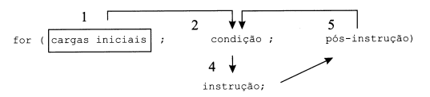
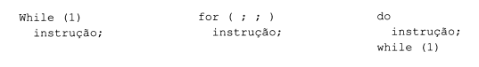
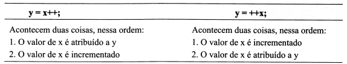
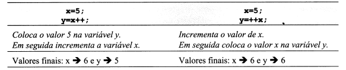
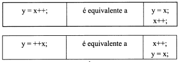

# Linguagem C

## Laços

### Introdução

Nos primeiros capítulos deste livro um programa não era mais do que uma sequência de instruções a serem executadas. No capítulo anterior abordamos uma nova forma de escrever programas, em que as instruções podem ou não ser executadas mediante uma ou mais condições predefinidas. O controle e de fluxo de um programa pode assim ser realizado através das instruções **if** e **switch** e através de outras instruções, que serão apresentadas neste capítulo e que permitem a repetição de instruções. Tais instruções, pelo papel que desempenham, são habitualmente designadas por instruções de **Controle de Fluxo** e incluem o `if`, o `switch` e os laços `switch`, `for` e `do...while`.

### While

A instrução **while** (também chamada de laço *while*) executa uma instrução ou bloco de instruções enquanto uma determinada condição for verdadeira. A sua sintaxe é:

```C

    while (condição)
        instrução;
```

O seu funcionamento pode ser resumido nos seguintes pontos:

- A condição é avaliada.
- Se o resultado da avaliação for Falso (0-zero), o laço termina e o programa continua na instrução imediatamente depois do while.
- Se o resultado da avaliação for Verdade (diferente de zero), é executada a instrução (ou bloco de instruções ali presente) associada ao while.
- Volta-se ao ponto 1.

Nota:

    A instrução de um laço também é chamada de CORPO DO LAÇO.

Nota:

    Em um while coloca-se entre parênteses a CONDIÇÃO QUE SE TEM QUE VERIFICAR para que a instrução ou bloco de instruções seja executado.

**Problema:** Escreva um programa que coloque na tela os primeiros 10 números inteiros.

A saída que pretendemos na tela é a seguinte:

    1
    2
    3
    4
    5
    6
    7
    8
    9
    10

***prog0401.c***

```C

#include <stdio.h>

int main()
{
    int i;
    i = 1;
    while (i <= 10)
    {
        printf("%d\n", i);
        i = i + 1;
    }
}
```

Para resolver esse problema, vamos começar por declarar uma variável do tipo inteiro que inicializamos com o valor 1 e que vai sendo escrita na tela **enquanto** o seu valor for **inferior ou igual a 10** (que é a condição presente no *while*).

Depois de escrita a variável através da função *printf*, é necessário incrementá-la em uma unidade, de forma a passar ao próximo valor.

Repare que o teste da condição é realizado antes da execução do bloco de instruções.

Note que é necessária a criação de um bloco dentro do *while*, pois é preciso executar duas instruções distintas (o *printf* e o incremento da variável) dentro de cada iteração do laço.

**Pergunta:** Qual seria a saída se não fossem colocadas as chaves na instrução do while?

**Resposta:** Iria originar um laço infinito, que imprimiria sempre o número 1, pois a variável de controle do laço nunca seria alterada, permanecendo a condição do laço eternamente Verdadeira.

Note ainda que é necessário que a variável que controla o laço seja alterada dentro desse laço, de forma a permitir que o mesmo em algum momento termine.

O que faz o programa que se segue?

***pro0402.c***

```C

#include <stdio.h>

int main()
{
    int n;
    n = 10;
    while (n)
    {
        printf ("%d\n", n);
        n = n - 1;
    }
}
```

A variável **n** é iniciada com 10.

A condição do while é representada pela própria variável **n**, isto é, a condição do while é verdadeira quando n apresentar um valor que não seja zero (pois zero é Falso). Dessa forma, escrever *while(n)* ou
*while (n 1= 0)* é exatamente o mesmo.

Se **n** tiver um valor diferente de zero, a condição devolve Verdade e então são executadas as duas instru-
ções dentro do bloco do *while* - escreve-se o valor de **n** e em seguida n é decrementado.

Quando **n** for zero, o programa termina. O número zero não é escrito, pois como zero representa o valor lógico **Falso** o laço termina e, nesse caso, o programa termina, pois não existe nenhuma instrução depois do laço while.

Em resumo, o programa anterior apresenta na tela os 10 primeiros números de forma decrescente.

**Problema:** Escreva um programa que coloque na tela a tabuada do número 5.

O que deve aparecer na tela é:

    5 * 1 = 5
    5 * 2 = 10
    5 * 3 = 15
    5 * 4 = 20
    5 * 5 = 25
    5 * 6 = 30
    5 * 7 = 35
    5 * 8 = 40
    5 * 9 = 45
    5 * 10 = 50

Analisando o problema, verifica-se que a primeira coluna tem sempre o valor 5.

Em seguida aparece uma coluna que varia entre 1 e 10 (que corresponde ao número de vezes que vamos iterar).

Na última coluna apresenta-se o resultado da multiplicação de 5 pelo valor atual da variável que controla o laço. O programa resultante é o seguinte:

***prog0403.c***

```C

#include <stdio.h>

int main()
{
    int n, num;

    printf ("Introd. um N°: "); scanf("%d", &num);
    n = 1;
    while (n<=10>)
    {
        printf("%2d * %2d = %2d\n", num, n, num * n);
        n = n+1;
    }
}
```

A solução é simples, e consiste em alterar todas as ocorrências da constante 5 pela nova variável *num*. O *printf* teve assim que ser adaptado, substituindo o valor 5 pelo formato de escrita do inteiro introduzido pelo usuário.

**Problema:** Escrever o conjunto das cinco primeiras tabuadas (tabuada do 1, 2, ..., tabuada do 5).

O processamento de uma tabuada genérica, armazena na variável num, é realizado pelo código seguinte:

```C

n = 1;

    while (n <= 10)
    {
        printf("%2d * %2d = %2d\n", num, n, num * n);
        n = n+1;
    }
```

O trecho anterior mostra a tabuada completa de um número armazenado na variável num. Como queremos mostrar as cinco primeiras tabuadas, queremos que esse número (*num*) varie entre 1 e 5.

***preg0405.c***

```C

#include <stdio.h>

num = 1;
while (num <= 5)
{
    n = 1;
    while (n <= 10)
    {
        printf("%2d * %2d = %2d\n", num, n, num * n);
        n = n+1;
    }
    /* Passar à próxima tabuada */
    num = num + 1;
}
```

**Atenção:**

    Antes de o laço interno ser iniciado, é necessário voltar a colocar a variável n com o valor 1. Dessa forma, a linha 10: tem que ser executada para cada nova tabuada armazenada em num, não podendo ser colocada antes do primeiro while.

**Workstation:** Pesquisa sobre a função `putchar`, pertecente também a vasta biblioteca `stdio.h`.

### For

A instrução `for` (ou laço **for**, como é vulgarmente conhecida), adapta-se particularmente a situações em
que o número de iterações é conhecido a priori. A sua sintaxe é:

    for (cargas iniciais ; condição ; pós-instrução) instrução;

Embora apresente um formato estranho, é um laço particularmente bem desenhado, que resume, em uma
mesma instrução repetitiva, tudo aquilo de que ela necessita.

O seu funcionamento pode ser resumido pelo seguinte esquema:



1. O código presente em **cargas iniciais** é executado. Normalmente aqui são iniciadas as variáveis presentes no loço. Esse componente do laço *for* é executado apenas uma única vez.

2. A **condição** é avaliada.

3. Se o resultado da condição retornar o valor Falso (zeor), então o laço *for* termina e o programa continua na instrução imediatamente a seguir.

4. Se o resultado da condição retornar o valor Verdade, então é executada a **instrução** (ou bloco de instruções) do laço.

5. Depois de executada a instrução presente no laço, é executada a pós-instrução. Nesse componente do laço for são normalmente realizadas as alterações necessárias para passar à próxima iteração do laço (incremento ou decremento de variáveis etc.)

6. Voltar ao ponto 2.

Voltamos a observar o programa **prog0401.c**:

***prog0401.c***

```C

#include <stdio.h>

int main()
{
    int i;
    i = 1;

    while (i <= 10)
    {
        printf("%d\n", i);
        i = i+1;
    }
}
```

Como sabemos a priori qual o número de vezes que é necessário iterar o laço (10 vezes), vamos reescrever o programa utilizando o laço *for*.

**Questão:** Quais são os componentes necessários ao laço?

- É necessário iniciar a variável de controle do laço.
- A condição se mantém.
- Escrever o número na tela.
- Para passar de uma iteração para a próxima devemos incrementar a variável de controle do laço em uma unidade.

Assim, o código

```C

i = 1;
while (i <= 10)
{
    printf("%d\n", i);
    i = i+1;
}

```

poderia ser escrito

```C

for (i = 1; i <= 10; i = i + 1)
    printf("%d\n", i);

```

Como se pode observar, o laço separa e identifica todos os componentes de um laço:

- As cargas iniciais.
- A condição que se tem que verificar para a instrução ser executada.
- A instrução.
- O salto que se faz de uma instrução para a outra.

**Problema:** Escreva um programa que calcule a soma e o produto dos **n** primeiros números naturais.

```C
    #include <stdio.h>

    int main()
    {
        int n, num, soma, produto;
        printf("Introd. um N°: "); scanf("%d", &num);

        for (soma = 0, n = produto = 1; n <= num; n=n+1)
        {
            soma = soma + n;
            produto = produto * n;
        }
        printf("Soma = %d\nProduto = %d\n", soma, produto);
    }
```

Nota:

    O laço for identifica os seus três componentes, separando-os por ponto-e-vírgula (;). Assim, se for necessário realizar mais do que uma carga inicial ou mais do que uma pós-instrução, estas deverão ser separadas por vírgula (,).

**Problema:** Escreva um programa que coloque na tela as cinco primeiras tabuadas, parando a tela depois de cada uma delas ser escrita.

***prog0408.c***

```C

```

Como se pode observar, os laços são muito mais reduzidos em tamanho e muito mais fáceis de ler.
O laço externo permite percorrer os valores das tabuadas a imprimir. O laço interno permite escrever a ta-
buada corrente.

Depois de uma tabuada ser completamente escrita, é realizado o teste para ver se a tela tem que parar ou
não.

Como se pretendia parar a tela depois de cada tabuada, uma vez terminado cada laço interno, é colocada
na tela a mensagem para pressionar a tecla **ENTER** e, em seguida, é realizada a leitura de um caractere,
usando a função *getchar()*. O caractere lido não é armazenado em nenhuma variável, pois o seu conteúdo
não nos interessa, sendo simplesmente descartado.
Como não faz qualquer sentido parar a tela depois de escrita a última tabuada, é realizado o teste para ve-
rificar se estamos ou não na última tabuada para tomar a decisão de esperar ou não pelo caractere
**ENTER**.

Ao contrário da maioria das linguagens, em que o laço *for* é um laço específico para iterar um número bem determinado de vezes, em C o laço for não é mais do que um laço *while*.

Assim, qualquer laço for

    for (cargas inicias; condição; pós-instrução)
        instrução;

poderá sempre ser reescrito como um laço *while*.

    cargas inicias;
    while (condição)
    {
        instrução;
        pós-instrução;
    }

### do...while

A instrução **do...while** (também conhecida por laço *do...while*) difere dos laços anteriores porque o teste da condição é realizado no fim do corpo (instruções ou bloco de instruções) do laço e não antes, como acontecia com os laços *while* e *for*.

Dessa forma o corpo do laço **do...while** é executado pelo menos uma vez, enquanto nos laços **while** e **for** o corpo do laço pode nunca ser executado (caso a condição seja Falsa *a priori*).

A sintaxe do laço *do...while* é:

```C

    do
        instrução;
    while(condição);
```

O seu funcionamento pode ser descrito da seguinte forma:

- A instrução (ou bloco de instruções) é executada.
- A condição é avaliada.
- Se o resultado da condição for Verdade, volta-se ao ponto 1.
- Se o resultado da condição for Falso, termina o laço e o programa continua na instrução seguinte ao laço.

O laço *do...while* está particularmente adaptado ao processo de menus.

**Problema:** Escreva um programa que apresente um menu com as opções Clientes, Fornecedores, Encomendas e Sair.

O programa deve apresentar o opção escolhida pelo usuário até que este deseje sair.

***prog0409.c***

```C

#include <stdio.h>

int main()
{
    char opcao;
    do
    {
        printf("\tM E N U   P R I N C I P A L\n");
        printf("\n\n\t\tClientes");
        printf("\n\n\t\tFornecedores");
        printf("\n\n\t\tEncomendas");
        printf("\n\n\t\tSair");
        printf("\n\n\t\tOpção: ");
        scanf("%c", &opcao);
        fflush(stdin);
        switch (opcao)
        {
            case 'c':
            case 'C': puts("Opção CLIENTES"); break;
            case 'f':
            case 'F': puts("Opção FORNECEDORES"); break;
            case 'e':
            case 'E': puts("Opção ENCOMENDAS"); break;
            case 's':
            case 'S': break; /* Não faz nada */
            default: puts("Opção INVÁLIDA!!!");
        }
        getchar(); /* Parar a tela */
    } while (opcao != 's' && opcao != 'S');
}
```

como se pode verificar, o teste da condição de saída é feito apenas depois de apresentado o menu pelo menos uma vez.

A linha 15: **fflush(stdin)**; permite limpar os caracteres que exisem no *buffer* do teclado. Mais informação sobre a utilização dessa função pode ser obtida no capítulo sobre arquivos.

Nota:

    Sempre que for necessário implementar um laço que tena que executar o seu corpo pelo menos uma vez, utilize o laço do...while. Evite usar truques.

#### Laços (Resumo)

|   |**while**|**for**|**do...while**|
|---|---------|-------|--------------|
|**Sintaxe**|while (cond) instrução|for(carga inic; cond; pos-inst) instrução|do instrução while (condição)|
|**Executa a instrução**|zero ou mais vezes|zero ou mais vezes|1 ou mais vezes|
|**Testa a condição**|antes da instrução|antes da instrução|depois da instrução|
|**Utilização**|frequente|frequente|pouco frequente|

**Problema:** Escreva um programa que mostre os 10 primeiros números pares.

***prog0410.c***

```C

#include <stdio.h>

int main()
{
    int i;
    for (i = 1; i <= 10; i = i+1)
        printf("%2d\n", 2*i);
}
```

Notes que os 10 primeiros números pares correspondem aos 10 primeiros números multiplicados por 2.

### break

A instrução *break* já é conhecida. O seu papel anterior consistia em terminar o conjunto das instruções executadas dentro de um *switch*.

A instrução **break**, quando aplicada dentro de um laço, termina o correspondente laço, continuando o programa na instrução imediatamente posterior a esse laço.

Nota:

    A instrução break pode ser utilizada para terminar uma sequência de instruções dentro de um switch ou para terminar um laço.

**Pergunta:** Qual a saída do seguinte programa?

***prog0411.c***

```C

#include <stdio.h>

int main()
{
    int i;
    for (i = 0; i <= 100; i = i + 1)
        if (i == 30)
            break;
        else
            printf("%2d\n", 2*i);
    printf("FIM DO LAÇO \n");
    
}
```

**Resposta:** Vai mostrar os primeiros 29 números pares (2,4,..., 58). Quando a variável i tiver o valor 30, é
executada a instrução break, terminando o laço. No entanto, o programa continua na próxima instrução,
escrevendo a **string FIM DO LAÇO**.

### continue

A instrução **continue** dentro de um laço permite que a execução da instrução ou bloco de instruções corrente seja terminada, passando à próxima iteração do laço.

Nota:

    A instrução continue, quando presente dentro de um laço, passa o laço para a próxima iteração.

**Pergunta:** Qual a saída do seguinte programa?

***prog0412.c***

```C

#include <stdio.h>

int main()
{
    int i;
    for (i = 1; i <= 100; i = i + 1)
        if (i == 60)
            break;
        else
            if (i % 2 == 1) /* se i for ímpar */
                continue;
            else
                printf("%2d\n", i);
    printf("FIM DO LAÇO\n");
}
```

**Resposta:** O programa vai percorrer todos os números entre 1 e 60 (por causa do break). Para cada um deles verifica se o número em questão é ímpar. Se for, termina a execução da instrução, executando em seguida a pós-instrução. Se não for ímpar, mostra-se o próprio número.

Resumindo, mostra os primeiros 29 números pares.

Nota:

    A instrução continue só pode ser utilizada dentro de laços, enquanto o break pode ser utilizado em laços ou na instrução switch.

### Laços Encadeados

Laços encadeados são laços (*while*, *for* ou *do...while*) que estejam presentes dentro de outros laços.

Não existe qualquer limitação ao número de laços que pode ocorrer dentro de outros laços.

Nota:

    Em C, cada laço interno não pode estender-se para além do laço externo a que pertence.

Exemplo (Má implementação de laços encadeados):

    while (x <= 5)
    {
        do 
        {
            printf("Introd. um N°:");
    }                           /* Fim do laço while */
            scanf("%d", &n)
        } while( x <= 0);   /* Fim do laço do...while */

Como se pode observar, o laço interno está meio fora e meio dentro do laço externo. Essa situação não é permitica pela linguagem C. O exemplo correto seria:

    while (x <= 5)
    {
        do
        {
            printf("Introd. um N°:");
            scanf("%d", &n);
        }   
        while (n<0);        /* Fim do laço do...while */
    }                       /* Fim do laço while */

**Problema:** Escreva um programa que coloque os seguintes números na tela:

    1
    1 2
    1 2 3
    ...
    1 2 3 4 5 6 7 8 9 10

***prog0413.c***

```C

#include <stdio.h>

int main()
{
    unsigned short int i = 1;
    unsigned short int j;

    while (i <= 10)
    {
        for (j = 1; j <= i; j++)
            printf("%hu ", j);
        putchar('\n');
        i++;
    }
}
```

Esse exemplo tinha por objetivo a impressão de 10 linhas na tela. An-ésima linha apresentaria apenas os
números 1 2 ... n. Nesse caso, o laço interno não apresenta úm número de iterações fixas, mas depende do
valor da variável de controle do laço exterior.

Nota:

    Nada impede que as variáveis de controle de um laço externo sejam alteradas pelo laço interno, e vice-versa. De igual forma, as variáveis de um laço interno podem ter ou não qualquer tipo de relação com as variáveis do laço externo.

Quando se está em presença de laços encadeados, a passagem de uma iteração para a próxima no laço ex-
terno só é realizada depois de completado o bloco de instruções que o compõem. Dessa forma, o laço in-
terno funciona como uma instrução simples, que tem que ser completamente executada antes de se passar
para a próxima iteração do laço externo.

Nota:

    As instruções break e continue só têm ação no laço a que pertencem, mesmo que estes se encontrem dentro de outros laços.

O exemplo anterior poderia ter sido escrito da seguinte forma:

***pro0414.c**

```C

#include <stdio.h>

int main()
{
    int i, j;

    for (i=1 ; i<=10 ; i=i+1)
    {
        for (j=1 ; j<=10 ; j=j+1)
        {
            printf("%d ", j);
            if (j == i)
                break;      /* já depois de escrever j */
        }
        putchar ('\n');
    }
}
```

Nota:

    Uma boa indentação facilita a leitura e a representação de laço encadeados.

### Laços Infinitos

Denominam-se laços infinitos aqueles que nunca terminam, isto é, apresentam condições que são sempre verdadeiras.

**Exemplos:**



Nota: 

    Quando no laço for não é colocada qualquer condição, esta é substituida pela condição VERDADE.

Esses tipos de laços são utilizados normalmente quando não se sabe a priori qual o número de vezes que se vai iterar o laço. Para terminar um laço infinito usa-se a instrução `break` ou `return`.

Alguns programadores usam esses tipos de laços para processarem os seus menus.

```C

while(1)
{   /* Apresentar o Menu */
    /* Ler a Opção */
    if (opção == ...)
        ...
    if (opção == SAIR)
        break;  /* Terminar o laço infinito */
}
```

### Operadores ++ e --

A linguagem C possui um conjunto de operadores particularmente úteis, que permitem realizar o incremento ou o decremento de variáveis, reduzindo significativamente a quantidade de código escrito.

Como temos visto em quase todos os programas apresentados, existem linhas de programação que se repetem em quase todos os programas e que são responsáveis pelo incremento ou decremento das variáveis.

***prog0401.c***

```C

#include <stdio.h>

int main()
{
    int i;
    i = 1;
    while (i <= 10)
    {
        printf("%d\n", i);
        i = i + 1;
    }
}
```

A linguagem C apresenta dois operadores unários que permitem incrementar ou decrementar uma variável (não podem ser usados em constantes).

|**Operador**|**Significado**|**Exemplos**|
|------------|---------------|------------|
|`++`|Incremento de 1|i++ , ++k|
|`--`|Decremento de 1|j--, --alfa|

Como se pode verificar pelos exemplos, ambos os operadores podem ser utilizados à esquerda e à direita dos operandos (variáveis).

|**Operador**|**Exemplo**|**Equivalente**|
|------------|-----------|---------------|
|`++`|x++ ou ++x| x = x + 1|
|`--`|x-- ou --x| x = x - 1|

O programa prog0401.c poderia, assim, ser alterado substituido a linha i=i+1 pof i++ ou ++i.

***prog0401.c***

```C

#include <stdio.h>

int main()
{
    int i;
    i = 1;
    while (i <= 10)
    {
        printf("%d\n", i);
        i++;
    }
}
```

Os operadores unários `++` e `--` podem ser utilizados em expressões ou mesmo em instruções mais com-
plexas do que um simples incremento ou decremento de variáveis. Nessas circunstâncias, a utilização
dos operadores à esquerda ou à direita de uma variável pode alterar o resultado final.


### Diferença entre ++x e x++

Quando se executa



Nota:

    Quando o operador de incremento ou decremento está antes da variável, esta é operada antes de ser usada. Quando o operador está depois da variável, esta é usada e só depois é incrementada ou decrementada.



Como se pode observar, o valor final das variáveis não é o mesmo.

Dessa forma, verificam-se as seguintes equivalências:



O que foi anteriomente apresentado para o operador ++ se aplica igualmente ao operador --.

**Questão:** qual a saída do seguinte programa?

    int a=b=3;
    printf("a = %d e b = %d\n", a--, --b);
    printf("a = %d e b = %d\n", a, b);

Repare que ambas as variáveis são iniciadas com o valor 3.

O primeiro *printf* escreve o valor da variável **a** (3) e, em seguida, a decrementa.

Em seguida decrementa a variável **b**, e só então é que a impreime (2).

O segundo *printf* escreve o valor presente em **a** e em **b**.

Assim, a saída seria

    3 2
    2 2

Como se pode verificar, ambas as variáveis são decrementadas em uma unidade, mas em tempos diferentes. A variavel **a** é usada e só depois é decrementada, enquanto a variável **b** é decrementada antes de ser usada.

O programa prog0401.c poderia então ser escrito da seguinte forma:

***prog0401.c***

```C

#include <stdio.h>

int main()
{
    int i;
    i = 1;
    while (i <= 10)
        printf("%d\n", i++);
}
```

A variável i é escrita com o printf Imediatamente depois de ser escrita é incrementada para o valor seguinte, evitando escrever o incremento fora do printf com o correspondente bloco de instruções. Note que a variável é incrementada imediatamente a seguir à sua utilização peloprintf Dessa forma, quando a condição do while é testada novamente a variável já está com o seu novo valor.

Atenção:

    Nunca se deve utilizar os operadores ++ ou -- em variáveis que apareçam mais do que uma vez numa mesma expressão.

Nota:

    Se os operadores ++ ou -- forem utilizados na condição de um if-else ou de qualquer outra instrução de controle de fluxo, mesmo que a condição seja falsa, a variável em questão é incrementada ou decrementada.

### Atribuição Composta

A linguagem C permite-nos reduzir a quantidade de código escrita sempre que se pretende que uma variável receba um valor que depende do valor que ela já tem.

**Exemplo:**

    x = x + 1;
    y = y * (a+5+b);
    z = z % 3;

Nessas situações, é descessário repetir o nome da variável no lado direito da atribuição. Vamos supor que queríamos adicionar 3 à variável x. Normalmente escreveríamos:

    x = x + 3;

Nessas situações, é desnecessário repetir o nome da variável no lado direito da atribuição. Vamos supor
que queríamos adicionar 3 à variável x. Normalmente escreveríamos:

    x = x + 3;

No entanto, usando uma atribuição composta bastaria escrever:

    x += 3;

Nota:

    Quando uma variável recebe um novo valor que depende do seu valor atual, pode-se evitar a duplicação da escrita da variável à esquerda e à direita colocando o operador imediatamene junto (à esquerda) da atribuição.

Mais genericamente, pode-se dizer que sendo **op** um operador binário

    var op= expressão

é equivalente a

    var = var op (expressão)

Nota:

    Quando se utilizam atribuições compostas, é absolutamente necessário que o operador fique imediatamente junto ao sinal de atribuição (=).

**Exemplos**

|**Exemplo**|**Significado**|
|-----------|---------------|
|x += 1| x = x + 1|
|y *= 2+3|y = y * (2+3)|
|a -= b+ 1| a = a - (b+1)|
|k /= 12|k = k / 12|
|r %=2| r = r % 2 |

Essa escrita das atribuições é um pouco menos legível do que uma atribuição normal. No entanto, é particularmente útil quando o nome da variável à esquerda é grande ou particularmente complexo.

