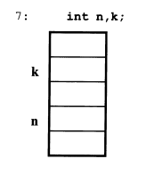
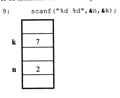
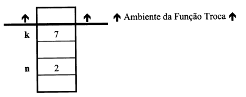
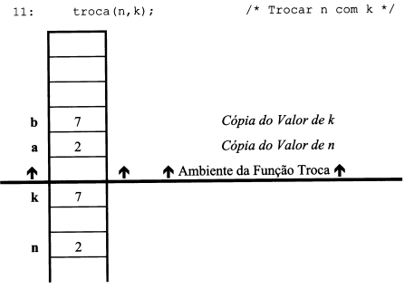
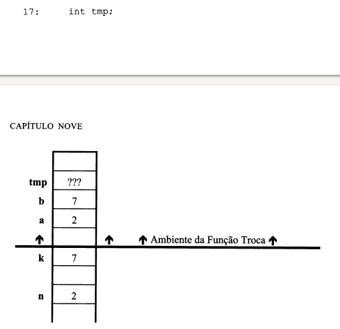
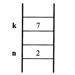

# Passagem de parâmetros

## Noções Básicas

Uma função é composta por quatro partes distintas:
1. Nome da função
2. Tipo de retorno
3. Lista de parâmetros
4. Corpo da função

Tomemos como exemplo a função **Maior**
```c
int Maior (int a, int b)
{
  return (a > b) ? a : b;
}
```

|   |   |
|---|---|
|**Nome da função**| Maior|
|**Tipo de Retorno**|int|
|**Lista de Parâmetros**|int a, int b|
|**Corpo da Função**| return (a>b) ? a : b;|

> [!NOTE]
**Uma função que não retorne qualquer tipo, isto é, que "retorne" void, chama-se vulgarmente procedimento. Não deixa por isso, em C, de ser uma função.**
> 

Depois de escrita uma função, está é invocada atráves do seu nome, seguido do conjunto de argumentos colocados entre parênteses.

> [!NOTE]
**O número e o tipo dos argumentos passados a uma função devem corresponder ao número e ao tipo dos parâmetros com que esta foi definida** 
> 

Exemplos: De invocação da função Maior
```c
printf("%d o maior entre x e y é %d\n", x, y, Maior(x, y));
big = Maior (a + 5, b - 1);
```
Uma função que tenha tipo de retorno pode ser invocada sem se aproveitar o valor por ela retornado.

**Exemplo:** Maior(a + 5, b - 1); "pela definição dessa função, ela retorna um int, mas o seu valor de retorno não está sendo utilizado."

## Tipo de retorno

Uma funçã **só pode retornar um valor** ( ou **nenhum**, se for um procedimento, como em `void` no C).

Mas... às vezes queremos **retornar mais de uma informação diferente.**

Por exemplo:
- Quantos números negativos tem em um vetor(`int`)
- Qual é o menor número do vetor(`float`)

Agora surge o problema: **o que retornar?**

Se só podemos retornar **um tipo**, vamos escolher `int` ou `float`?

### Solução sugerida no texto:

Em vez de tentar retornar várias coisas, **passamos as variáveis por referência** (ou seja, como parâmetros de entrada/saída para a função). Assim, a função **modifica diretamente essas variáveis**.

Exemplo:
```c
void conta_negativos(float *vetor, int tamanho, int *quant_negativos, float *menor) {
    int cont = 0;
    float min = vetor[0];

    for (int i = 0; i < tamanho; i++) {
        if (vetor[i] < 0) {
            cont++;
            if (vetor[i] < min) {
                min = vetor[i];
            }
        }
    }

    *quant_negativos = cont;
    *menor = min;
}
```

```c
int qtd;
float menor_valor;
float vet[] = {-2.5, 3.0, -1.2, 0.0};

conta_negativos(vet, 4, &qtd, &menor_valor);

// Agora qtd e menor_valor têm os resultados!

```

#### Conclusão

O parágrafo só quer dizer isso:

  Como só é possível retornar **um valor**, se precisar de mais de uma     resultado, **passe variáveis por referência** (ou use ponteiros, no caso do C) para a função preencher.

## Troca - O Exemplo Clássico

Uma das operações que realizamos com maior frêquencia é a troca de valores entre variáveis. Por exemplo, a definição de um vetor é realizada atráves de trocas sucessivas de elementos, até que todos eles se apresentam de acordo com uma determinada ordem.

Uma troca realiza-se sempre em três passos e necessita smepre de uma variável auxiliar do tipo dos elementos a serem trocados, da mesma forma que, prar trocar o contéudo de dois corpos, um com leite outro com café, teremos que utilizar um outro copo auxiliar para não misturar os dois líquidos.

```c
void troca (int a, int b)
{
  int tmp = ;
  a = b;
  b = tmp;
}
```

Como se pode observar, os inteiros a serem trocados terão que ser enviados para o procedimento, o qual deverá, internamente, realizar a troca dos mesmos, colocando os novos valores nas mesmas variáveis.


Exemplo completo para a realização de trocas de dois inteiros.

```c
#include <stdio.h>

void troca (int a, int b);

main()
{
  int n, k;
  puts("Introd. dois N°s Inteiros");
  scanf("%d %d", &n, &k);
  printf("Antes da troca n=%d e k=%d\n", n, k);
  troca(n, k);
  printf("Depois da troca n=%d e k=%d\n", n, k);
}

void troca (int a, int b)
{
  int tmp = a;
  a = b;
  b = tmp;
}
```

Executa o código e vejas as saidas dos valores.

## Tipo de Passagem de Parâmetros

Sempre que se enviam argumentos para uma função, estes têm que ser armazenados em memória unicamente durante a execução da função, sendo dopois eliminados.

No caso do programa de troca de inteiros, quando este começa a executar necessita apenas de duas variáveis:
  int n, k



Quando o usuário introduz os valores (2 e 7, por exemplo), estes serão colocados nas respetivas posições de memória através da função **scanf**



## Invocação de uma Função

Sempre que uma função é invocada, é criado um ambiente próprio no qual é feito a criação das variáveis necessárias à execução do código dessa função. É como de fosse criada uma barreira, que corte a ligação com o resto da programa que a invocou.



Em seguida é alocado espaço para os parâmetros da função,

  void troca(int a, int b)

os quais são automaticamente iniciados com os valores que lhes foram enviados pelo programa invocador



Em seguida é alocado o espaço para as variáveis locais à função, as quais, se não forem inicadas pelo programador, ficam com lixo.



Depois são executadas as três atribuições que fazem parte da função troca,

  tmp = a;
  a = b;
  b = tmp;

Como se pode verificar, os valores de **a** e **b** estão na realidade trocados.

Como o código executado pela função já terminou, todo o ambiente associado a função vai ser destruído, voltando o controle da execução para o program que a invocou.



> [!NOTE]
**Depois de terminada uma função, todo o ambiente em que está executou é elimindado.**
> 

Como se pode observar, os valores das variáveis originais permanecem inalterados, pois estivemos na realidade trocando não os valores das variáveis, mas sim cópias destes.

Na maioria das linguagens de programação de terceira geração, a que o C também pertence, existem, em geral, dois tipos distintos de passagem de paâmetros, isto é, as variáveis ou expressões podem ser enviadas para os parâmetros de uma função de duas maneiras distintas - por **Valor** ou por **Referência**.


