### Aritmética de Ponteiros

Sendo os ponteiros números que representam posições de memória, podem ser realizadas algumas operações aritméticas (incremento, decremento, diferença e comparação) sobre eles. Essas operações podem, no entanto, ser um pouco diferentes daquelas a que estamos habituadas, mas não se preocupe, pois essas diferentes só servem para nos facilitar a vida.

1. Incremento

Um ponteiro pode ser incrementado como qualquer variável. No entanto, o incremento de uma unidade não significa que o endereço anteriomente armazenado no ponteiro seja incrementado em um *byte*.

Na realidade, se **ptr** é um ponteiro para um determinado tipo, quando **ptr** é incrementado, por exemplo, de uma unidade, o endereço que passa a conter é igual ao endereço de **ptr + sizeof(tipo)** para que o ponteiro aponta, isto é, o ponteiro avança não um *byte*, mas sim a dimensão do tipo do objeto para o qual aponta.

Nota:

    Um ponteiro para o tipo xyz avança sempre o sizeof(xyz) bytes por unidade de incremento.

```prog0801.c```

```C

#include <stdio.h>

int main()
{
    int x = 5, *px = &x;
    float y = 5.0, *py = &y;

    printf("%d %ld\n", x, (long) px);
    printf("%d %ld\n", x+1, (long) (px+1));

    printf("%f %ld\n", y, (long) py);
    printf("%f %ld\n", y+1, (long) (py+1));

}

```

No programa anterior, declaramos duas variáveis **x** e **y** do tipo *int* e *float*, ambas iniciadas com o valor 5. Declaramos também dois ponteiros **px** e **py** que apontam para **x** e **y**, respetivamente.

Em seguida, mostramos o valor das variáveis e o seu endereço armazenado no respetivo ponteiro. Depois mostramos o valor das mesmas variáveis incrementado em uma unidade.

    5 1211048978
    6 1211048980
    5.000000 1211048970
    6.000000 1211048974

Repare que tanto **x** como **y** são incrementados em uma unidade, enquanto os respetivos ponteiros são incrementados no número de bytes que o ocupam nessa arquitetura (**int** - dois bytes, **float** - quatro bytes).

Nota: Os endereços apresentados nesse exemplo variam de máquina e de execução para execução. Verifique apenas se existe a diferença entre os ponteiros.

Os endereços são transformados em um *long int* para melhor compreensão do resultado.

Na operação de incremento, podem-se utilizar os operadores normais:

```C

    ptr++;
    ptr = ptr + 2;
    ptr += 4; /* Se ptr apontar par um float avança 4*4=16 Bytes **/

```

2. Decremento

O decremento de ponteiros funciona da mesma forma que o incremento anteriormente apresentado.

Nota:

    Um ponteiro para o tipo xyz recua sempre sizeof(xyz) bytes por unidade de decremento.

**Exemplo:** Escreva um programa que mostre uma string na tela pela ordem em que está escrita e pela ordem contrária.

```C

#include <stdio.h>

int main()
{
    char s[100];
    char *ptr = s; /* Aponta para o primeiro caracter de s */

    printf("Introduza uma String: "); fgets(s, sizeof(s), stdin);

    if (*ptr == '\0') return 0;  /* ou return 0 se der erro de compil.*/
        /* String Vazia */

    /* Imprimir a string Normalmente */

    while (*ptr != '\0')
        putchar(*ptr++);
    
    /* Imprimir a string ao contrário */

    ptr--; /* Por causa do '\0' */

    while (ptr>=s)  /* Enquanto ptr for >= que &s[0] */
        putchar(*ptr--);
    
}

```

Nore que

    while (*ptr != '\0)
        putchar (*ptr++);

é equivalente a

    while (*ptr != '\0)             /* Enquanto não for final de string         */
        {
            putchar (*ptr);         /* Escreve o caracter       */
            ptr++;                  /* Avança com o ponteiro        */
        }


3. Diferença

A operação de diferença entre dois ponteiros para elementos do mesmo tipo permite saber quantos elementos existem entre um endereço e o outro.

Por exemplo, o comprimento de uma string pode ser obtido através da diferença entre o endereço do caractere '\0' e o endereço do caractere original.

Nota:

    A diferença entre ponteiros só pode ser realizada entre ponteiros do mesmo tipo.


***prog0803.c***

```C

#include <stdio.h>
int strlen(char *s);    /* Protṕtipo da função */

int main()
{
    char s[100];
    char *ptr = s; /* Aponta para o primeiro caractere de s */

    printf("Introduza uma String: ");   fgets(s, sizeof(s), stdin);

    printf("%d\n", strlen(s));
}

int strlen(char *s)
{
    char *ptr = s;          /* Guardar o endereço inicial */
    while (*s != '\0')      /* Enquanto não for o fim da string */
        s++;                /* Avançar para o próximo caractere */
    
    return (int) (s-ptr); /* Retornar a diferença entre o endereço final e o inicial */
}

```

4. Comparação

É também possível a comparação de dois ponteiros para o mesmo tipo, utilizando os operadores relacionais(<,<=,>,>=, == e !=).

Nota:

    A diferença e a comparação entre ponteiros só podem ser realizadas entre ponteiros do mesmo tipo.

#### Resumo das Operações sobre Ponteiros

|**Operação**|**Exemplo**|**Observações**|
|------------|-----------|---------------|
|**Atribuição**|ptr = &x| Podemos atribuir um valor (endereço) a um ponteiro. Se quisermos que aponte para nada podemos atribuir-lhe o valor da constante **NULL**|
|**Incremento**|ptr=ptr+2|Incremento de 2*sizeof(tipo) de ptr.|
|**Decremento**|ptr=ptr-10|Decremento de 10*sizeof(tipo) de ptr.|
|**Apontado por**|*ptr|O operador asterisco permite obter o valor existente na posição cujo endereço está armazenado em ptr.|
|**Endereço de**|&ptr|Tal como qualquer outra variável, um ponteiro ocupa espaço em memória. Dessa forma podemos saber qual o endereço que um ponteiro ocupa em memória.|
|**Diferença**|ptr1-ptr2|Permite-nos saber qual o n° de elementos entre ptr1 e ptr2|
|**Comparação**|ptr1>ptr2|Permite-nos verificar, exemplo,qual a ordem de dois elementos num vetor através do valor dos seus endereços.|

Nota:

    Sendo o nome de um vetor o endereço do seu primeiro elemento, podemos com ele realizar todas as operações a que temos acesso quando manipulamos ponteiros, desde que essas operações não alterem o seu valor, pois o nome de um vetor é uma constante.

**Exemplos:**

s="ole"     /* Erro de Compilação. Devia usar strcpy */
s++         /* Erro: Não podemos alterar s          */
s+1         /* OK: Não estamos alterando s          */
*s          /* Ok                                   */
(S)++       /* Ok: Não estamos aterando s, mas sim um dos seus chars */
s = s-2     /* Erro: Não podemos aterar s           */
s > s+1     /* Ok                                   */
s + 1-s     /* Ok                                   */

Se ptr for um ponteiro para um vetor de caracteres, então

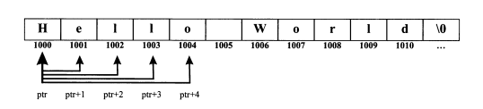

Se ptr for um ponteiro para um vetor de inteiros (dois bytes cada), então

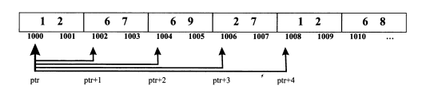

Se ptr for um ponteiro para um vetor de floats (quatro bytes cada), então

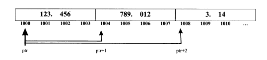

Como se pode verificar pelos esquemas apresentados, cada ponteiro se move o número de bytes que ocupa o tipo para o qual aponta. Dessa forma, evita-se que o programador tenga de indicar qual o número exato de bytes que o ponteiro deve avançar ou retroceder, sendo apenas necessário indicar qual número de elementos a avançar.

### Ponteiros e Vetore - Acesso aos Elementos

Suponhamos a seguinte declaração:

    char s[] = "OlaOleOli";
    char *ptr = s;  /* ptr fica com o &s[0] */

**Problema:** Como poderemos acessar o caractere 'a' presente na string?

|||
|---------------|---------------------|
|**s[2]**|Caractere existente na posição índice 2 do vetor.|
|**\*(ptr+2)**|Como ptr contém o endereço do primeiro caractere, se lhe adicionarmos 2 obtemos o endereço do caractere 'a'. Para obter o caractere 'a' bastará usar o operador *(**Apontado por**).|
|**\*(s+2)**|Se s==&s[0] pode-se usar a mesma estrátegia que foi usada no exemplo anterior.|
|**ptr[2]**|O endereçamento de elementos através de colchetes pode ser realizado também por ponteiros, como se tratasse de um vetor.|

Se **vetor** for um vetor já declarado, então

    vetor[0] == *(vetor + 0) ou *(vetor)
    vetor[1] == *(vetor + 1)
    vetor[2] == *(vetor + 2)
    vetor[n] == *(vetor + n)

pois o nome de um vetor é um ponteiro para o primeiro elemento desse mesmo vetor, o qual poderá ser acessado por *vetor. Em relação aos outros elementos, bastará utilizar os conceitos de aritmética de ponteiros anteriomente apresentados, posicionando-se no endereço do elemento pretendido, através de somas ou subtrações, e utilizando o operador *(Anpondo por) para obter o contéudo dessa posição do vetor.

Nota:

    Se v for um vetor ou um ponteiro para o primeiro elemento de um vetor, então para obter o elemento índice n desse vetor pode-se fazer v[n] ou *(v+n).
    v[n]==*(v+n)

### Passagem de Vetores para Funções

Sempre que declaramos um vetor, o seu espaço é alocado continuamente em memória. A posição que ele ocupa em memória pode ser obtida pelo nome do vetor que contém o endereço do primeiro elemento.

    char s[10] = "Ola";

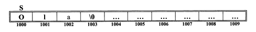

Sempre que invocamos uma função e lhe passamos o vetor como parâmetro, esta na realidade não recebe o vetor na sua totalidade, mas apenas o endereço inicial do vetor, pois estamos passando **s == &s[0]**.

Se passarmos um endereço, então a variável que o recebe terá que ser um ponteiro para o tipo dos elementos do vetor.

Por essa razão é que no cabeçalho de uma função que recebe um vetor como argumento aparece normalmente um ponteiro recebendo o respetivo parâmetro.

```C
#include <stdio.h>


int strlen(char *s)
{
    char *ptr = s;          // Guardar o endereço inicial
    while (*s != '\0')      // Enquanto não for o fim da string
        s++;                // Avançar para o próximo caractere
    
    return (int) (s - ptr); // Retornar a diferença entre o endereço final e o inicial
}

int main()
{
    char Nome[100];

    printf("Introduza o seu nome: ");  fgets(Nome, sizeof(Nome), stdin);

    printf("%d\n", strlen(Nome));
}
```

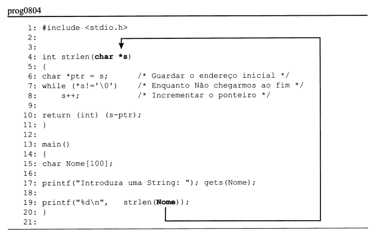


Repare como o exemplo funciona: declara-se uma string denominada Nome, e suponhamos que o usuário introduza o nome **Maria**.

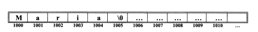

Em seguida, pretendemos calcular o comprimento da string, enviando-a para a função **strlen**.

Esta, no entanto, apenas vai receber o endereço original da string (1000), que vai armazenar no parâmetro **s** da função.

Seguidamente, declara-se um outro ponteiro local à função, para guardar o endereço original da string.

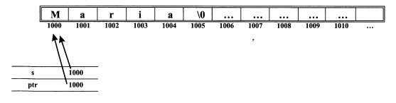

O objetivo seguinte é percorrer a string até encontrar o **'\0'**, avançando com o ponteiro **s**.

    while (*s != '\0')          /* Enquanto não chegarmos ao fim */
        s++;                    /* Incrementar o ponteiro */

Quando o laço terminar, estamos na seguinte situação:

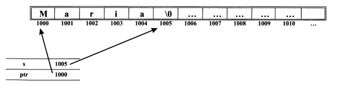

Vejamos agora como poderíamos ter implementado a função

```C
char * strcpy (char * dest, char * orig)
{
    char *tmp = dest;
    while (*dest++ = *orig++)
        ;
    return tmp;
}
```

Mais uma vez, a função recebe o endereço das duas strings

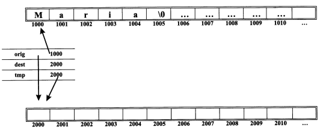

copiando em seguida caractere a caractere da string **orig** para a string **dest**.

Repare que o operador ++ está à direita das variáveis, por essa razão as variáveis **orig** e **dest** só são alteradas depois da atribuição.

O laço *while* é semelhante a:

```C
while (*dest = *orig++)
{
    dest++;
    orig++;
}
```

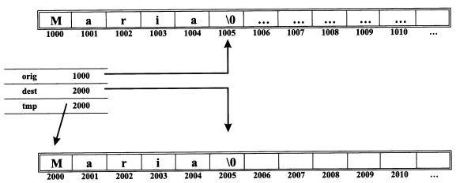

Depois de copiados todos os caracteres de **orig** (delimitador incluído) é necessário retornar o endereço inicial da string de destino. No entanto, esse endereço já foi perdido pelo fato de **dest** ter avançado ao longo das posições da string.

Para resolver esse problema, antes de alterar o ponteiro **dest** coloca-se o seu valor numa variável temporária:

    char *tmp = dest;

No final da função basta retornar o valor armazenado em **tmp**:

    return tmp;

Vamos implementar agora a função:

**char * strcat(char * dest, char * orig)**

que junta (concatena) a string **orig** para o final da string **dest**.

```C
char *strcat(char *dest, char *orig)
{
    strcpy(dest+strlen(dest), orig);
    return dest;
}
```

Uma vez que queremos copiar uma string para o final da outra, enviamos os endereços de início da *string* **orig** e o endereço do '\0' da string **dest** para que a cópia seja realizada a partir desses endereços, e não a partir dos endereços de origem de ambas as strings.

Depois de terminada a função **strcpy**, bastará retornar **dest**, isto é, o endereço inicial da string destino.

Nota:

    Sempre que se passa um vetor para uma função, apenas o endereço original deste é efetivamente enviado para a função. É assim impossível saber, dentro de uma função, qual a dimensão dos vetores que foram passados, a menos que se envie um outro parâmetro indicador do número de elementos ou um delimitador em cada vetor. Assim, é da responsabilidade do programador garantir que os vetores enviados para as funções contêm os elementos necessários ao processamento a que serão submetidos.

### Ponteiros de Ponteiros

Uma vez que os ponteiros ocupam espaço em memória, é possível obter a sua posição através do operador endereço **&**.

**Pergunta:** Se você estiver interessado em armazenar o endereço de um ponteiro, qual o tipo da variável que irá recebê-lo?

**Resposta:**

- Suponhamos uma variável do tipo *int* chamada x.

```C
    int x;
```

- Se pretendermos armazenar o seu endereço, declaramos um ponteiro para o tipo da variável (*int*), isto é, colocamos um asterisco entre o tipo da variável para que queremos apontar e o nome do ponteiro.

```C
int * ptr_x;        /* Ponteiro para x */
```

- Se quisermos armazenar o endereço desse ponteiro, seguimos exatamente os mesmos passos, declarando uma variável do tipo do ponteiro ptr_x(*int*) e colocando entre o tipo da variável para a qual queremos apontar e nome do ponteiro.

```C
int **ptr_ptr_x;    /* Ponteiro para o ponteiro de x */
```

- E assim sucessivamente, sem qualquer limitação para o número de asteriscos.

No exemplo seguinte os três **printf** colocam a mesma informação na tela.

**Exemplo:**

***prog0805.c***

```C
#include <stdio.h>

int main()
{
    int x =5;
    int *ptr_x;
    int **ptr_ptr_x;

    /* Carga inicial dos ponteiros */

    ptr_x = &x;                
    ptr_ptr_x = &ptr_x;

    printf("x = %d - $x = %p\n", x, &x);
    printf("x = %d - &x = %p\n", *ptr_x, ptr_x);
    printf("x = %d - &x = %p\n", *(*ptr_ptr_x), *ptr_ptr_x);

}
```

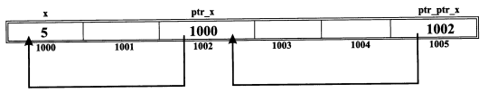

Como se pode ver, **ptr_x** aponta para a variável **x**, enquanto **ptr_x** aponta para **ptr_x**.

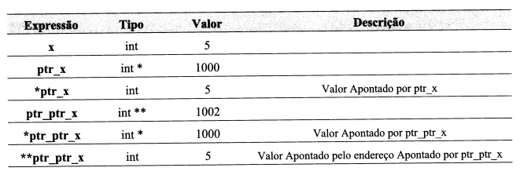

Aqui fica uma dica para quem tiver dúvidas sobre o que estamos falando quando temos uma variável com alguns asteriscos.

A dica é: olhe para a declaração e separe o valor que você quer analisar do restante da declaração.

Por exemplo, na declaração:

    char **ptr;

Qual o tipo que corresponde a **\*ptr**?

Se separarmos **\*ptr** do resto da declaração:

    char *          *ptr;

ficamos sabendo que o tipo de **\*ptr** é **char** (provalmente uma String).

Se separamos **\*\*ptr** do resto da declaração:

    char **     ptr;

ficamos sabendo que **ptr** é um ponteiro para um ponteiro de caracteres. (Provalvemente será um vetor de strings.)

#### Notas finais

É necessário prestar atenção em alguns pontos sobre ponteiros:

1. Um ponteiro é uma variável que não tem memória própria (apenas possui o espaço para conter um endereço), apontando normalmente para outros objetivos já existentes. Funciona, mais ou menos, como um comando de televisão.

2. Embora seja possível utilizá-los como vetores, os ponteiros não possuem memória própria. Só se pode utilizar o endereçamento através de um ponteiro depois que este está apontando para algum objeto já existente.

3. Não se deve fazer cargas iniciais de objetos apontados por um ponteiro que ainda não tenha sido iniciado.

**Exemplo:**

```C
int *p;             /* p fica com lixo no seu interior,
                        isto é, aponta para um local qualquer */
*p = 234;           /* Vamos colocar 234 no local para
                        onde p aponta.
                        Podemos vir a perder dados do programa */
```

4. Por segurança, inicie sempre os seus ponteiros. Se não souber onde apontá-los, inicie-os com NULL.

5. Nunca se deve confundir ponteiros com vetores sem dimensão. Se não sabemos qual a dimensão de que necessitamos, como o compilador poderá saber?

6. Em uma declaração de um ponteiro com carga inicial automática

    int *p = NULL;

    é o ponteiro **p** que é iniciado, e não **\*p**, embora a atribuição possa por vezes sugerir o contrário.

