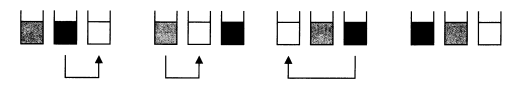
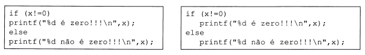
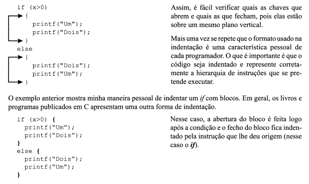
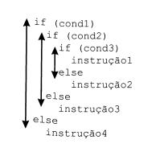
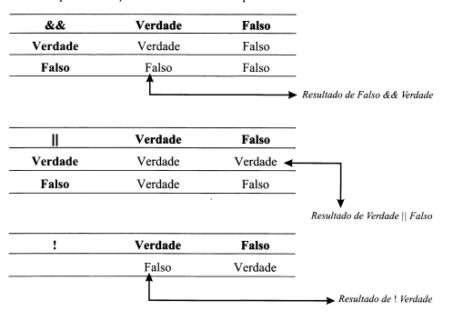
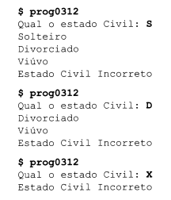

# Linguagem C

## Testes e Condições

### Valores Lógicos -- Verdadeiro e Falso

Como vimos no capitulo anterior, a linguagem C possui apenas quatro tipos de dados (`int`, `float`, `char`, `double`), não existindo nenhum tipo que permita representar os valores lógicos (Verdadeiro e Falso). Existem, contudo, linguagens que disponibilizam um tipo especifico para representar valores lógicos (EX.: BOOLEAN em PASCAL, o qual pode receber os valores TRUE  e FALSE).

Nota:

- Em C não existe nenhum tipo específico de dados para armazenar valores lógicos.

- Em C o valor lógico FALSO é representado por 0 (ZERO).

- Tudo aquilo que seja diferente de 0 (ZERO) representa o valor lógico VERDADEIRO.

**Exemplo:**

    Falso       : 0
    Verdade     : 2, -3, 123.43, 0.000001

Nota:

    O valor lógico VERDADEIRO em C não é o valor 1, mas sim qualquer valor diferente de 0 (ZERO).

    O valor 1 é apenas um dos valores possíveis para representar VERDADEIRO.

**Exemplos:**

    A terra é quadrada. (FALSO)
    O gelo apresenta-se no estado sólido. (VERDADE)
    O valor 20 é superior ao valor 14. (VERDADE)
    O valor 20 é superior. (FALSO)

#### Operadores Relacionais

Em C existe um conjunto de seis operadores relacionais, os quais podem ser usados na avaliação de expressões. Seu objetivo consiste no estabelecimento de relações entre os operandos.

|**Operador**|**Nome**|**Exemplo**|**Significado do Exemplo**|
|---------------|-------------|------------|--------|
|`==`|Igualdade|a == b|a é **igual** a b|
|`>`|Maior que|a > b|a é **maior** que b?|
|`>=`|Maior ou Igual que|a >= b|a é **maior ou igual** a b?|
|`<`|Menor que|a<b|a é **menor** que b?|
|`<=`|Menor ou Igual que|a <= b|a é **menor ou igual** a b?|
|`!=`|Diferente de |a != b|a é **diferente** de b?|

Nota:

    Uma expressão que contenha um operador relacional devolve sempre como resultado o valor lógico VERDADE (1) ou FALSO (0).

**Exemplo:**

***prog0301.c***

```C

    #include <stdio.h>

    int main()
    {
        int x, y;

        printf("Introduza 2 inteiros: ");
        scanf("%d%d", &x, &y);

        printf("O resultado de %d == %d     : %d\n", x, y, x == y);
        printf("O resultado de %d > %d      : %d\n", x, y, x > y);
        printf("O resultado de %d >= %d     : %d\n", x, y, x >= y);
        printf("O resultado de %d < %d      : %d\n", x, y, x < y);
        printf("O resultado de %d <= %d     : %d\n", x, y, x <= y);
        printf("O resultado de %d != %d     : %d\n", x, y, x != y);
        
    }
```

No exemplo anterior, as expressões são avaliadas e o resultado de cada avaliação é escrito como inteiro (0 - Falso, 1 - Verdadeiro).

Os operadores relacionais podem ser aplicados a expressões simples ou complexas.

**Exemplo:**

    4 >= 2
    x <= y
    (x+y) < (x*2+y*(-4))

**Atenção:**

    Um erro muito frequente em programação é a troca do operador == pelo operador =. O operador == verifica se duas expressões são iguais, enquanto o operador = é utilizado para a atribuição de valores a variáveis.

#### if-else

A instrução ***if-else*** é uma das instruções de controle de fluxo da linguagem C. Permite indicar quais as cir-
cunstâncias em que se deve executar determinada instrução ou conjunto de instruções.

A sintaxe é:

    if (condição)
        instrução 1;
    [ else instrução 2; ]

Como se pode observar, a componente ***else*** do ***if*** é falcultativa (colchetes).

Essa instrução permite a existência de instruções que não sejam executadas num programa. Para tal, basta que a condição necessária para a sua execução nunca se verifique.

**A instrução if-else funciona da seguinte maneira:**
 
- A condição é avaliada;
- Se o resultado da condição for verdadeira, executa a instrução1;
- Se o resultado da condição for falso, executa a instrução2 (caso exista o else).

Nota:

    A condição do if tem que estar sempre dentro de parênteses. Tanto a instrução1 como a instrução2 são seguidas de ponto-e-vírgula (;)

**Exemplo:** Implemente um programa que indique se um número é positivo (>=0) ou negativo.

***prog0302.c***

```C

    #include <stdio.h>

    int main()
    {
        int x;

        printf("Introduza um N° ");
        scanf("%d", &x);

        if (x >= 0)
            printf ("Número Positivo\n");
        else
            printf("Número Negativo\n");    
    }
```

No exemplo anterior é solicitado e lido um inteiro (linhas 6: e 7:). Como se pretende indicar se o número
lido é positivo ou negativo, vamos testar se o número x é maior ou igual a zero utilizando o operador rela-
cional >=.

Se o resultado da avaliação da expressão (x>=0) for **Verdadeiro**, então invoca-se a função printfcom a
string "Número Positivo\n" (linha 9:); caso contrário, isto é, se a avaliação de (x>=0) devolver o
valor **Falso** (zero), invoca-se a função printf com a string **"Número Negativo\n"**.

**Exemplo:** Implemente um programa que indique se o inteiro lido é zero ou não.

***prog0303.c***

```C

    #include <stdio.h>

    int main()
    {
        int x;

        printf("Introduza um N° ");
        scanf("%d", &x);
        if (x != 0)
            printf("%d não é zero!!!\n", x);
        else
            printf("%d é igual a zero!!!\n", x);
    }
```

Este programa é semelhante ao anterior, só o tipo de teste é que é diferente, pois utiliza o operador `!=` (diferente).

Repare agora no seguinte pormenor.

Quando o valor de x é diferente de zero, o resultado da avaliação da expressão x!=0 devolve o valor **Verdade**. Ora, como x é diferente de zero (e como zero é **Falso**, e tudo o que é diferente de zero representa
**Verdade**), x representa por si só o valor lógico **Verdade** (pois é diferente de zero). Por isso, escrever (x!=0) ou (x) é exatamente a mesma coisa

**Exemplo:**

|**Valor de x**|**Valor Lógico Representado por x**|**Valor Lógico: x!=0**|
|------------------|------------|-----------|
|5|Verdade|Verdade|
|0|Falso|Falso|
|-5|Verdade|Verdade|

Dessa maneira, o programa anterior poderia ter sido escrito da seguinte forma:

***prog0303.c***

```C

    #include <stdio.h>

    int main()
    {
        int x;

        printf("Introduza um N° ");
        scanf("%d", &x);
        
        if (x) /* em vez de if (x!=0) */
            printf("%d não é zero!!!\n", x);
        else
            printf("%d é igual a zero!!!\n", x);
    }
```

Como se pode verificar, existem mil e uma maneiras de escrever um programa corretamente. No entanto,
nessa última versão perde-se legibilidade, uma vez que se aproveita o valor de uma variável como valor
lógico, em vez de se usar o teste x!=0, que representa o teste que na realidade pretendemos realizar.

Nota:

    Em C, o valor de uma variável ou de uma constante pode ser aproveitado pelo programador como valor lógico, utilizando-o como FALSO (caso 0) ou VERDADE (caso seja diferente de O).

Em geral os programadores mais experientes em C gostam de escrever um código que mais ninguém
compreende, recorrendo a algumas características da própria linguagem. No entanto, muitas vezes o có-
digo por eles escrito é de tal forma compacto ou confuso que até eles mesmos têm dificuldades de
entendê-lo.

Nota:

    Um programa deve estar escrito de tal maneira que um leve passar de olhos pelo código indique ao leitor, sem sombra de dúvidas, aquilo que a aplicação deve fazer

**Exemplo:** Implementa um programa que adicione $1.000,00 ao salário de um indivíduo, caso este seja inferior a $100.000,00;

***prog0304.c***

```C

    #include <stdio.h>

    int main()
    {
        float salario;
        printf("Qual o salário ");
        scanf("%f", &salario);
        if (salario < 100000)
            salario = salario + 1000;
        printf("Salário Final: %.2f\n", salario);
        
    }
```

No programa prog0304.c, o salário só recebe a adição de $1.000,00 caso seja inferior a $100.000,00.

Nesse caso, só nos interessa executar a linha 9, para os indivíduos que estejam na condição de receberem
menos de $100.000,00.

Nota:

    Embora o enunciado represente o valor como $100.000,00, este número computacionalmente é sempre representado por 100000 ou 100000.00.

Aqueles que recebem $ 100.000,00 ou um valor superior ficam exatamente como estão, não havendo por
isso necessidade de implementar um else.

Note que
    
    printf("Salário Final: %.2f\n",salario);

apresenta uma pequena novidade, que é o formato de escrita do salário.

Já sabíamos que o formato de escrita de umfloat é %f. A fim de evitar que este nos apresente um grande número de casas decimais, indicamos que depois do ponto vêm apenas dois dígitos (.2). Assim o real escrito apresenta apenas as duas casas decimais mais significativas da sua parte fracionária, não estando a parte inteira de algum modo limitada.

#### Blocos de Instruções

Como se pode observar pela sintaxe da instrução **if-else**, apenas **UMA E UMA SÓ INSTRUÇÃO** pode seguir `if` ou o `else`.

Caso se deseje que um conjunto de instruções seja realizado, quer no **if** no ***else***, estas devem ser escritas entre `{}` de forma que este conjunto de instruções forme apenas um único Bloco de Instruções.

Um **Bloco** é, assim, um conjunto de duas ou mais instruções delimitadas por chaves.

Um **Bloco** pode ser colocado sem problemas num programa, no local em que possa estar numa instrução simples.

Nota:

    Depois de um Bloco não é necessário colocar ponto-e-vírgula (!).

**Exemplo:** Escreva um programa que leia dois números e os apresente por ordem crescente.

***prog0305.c***

```C

   #include <stdio.h>

    int main()
    {
        int x, y, temp;
        printf("Introd. dois N°s: ");
        scanf("%d %d", &x, &y);
        if (x > y)
        {
            temp = x;
            x = y;
            y = temp;
        }
        printf("Ordem crescente dos valores inseridos: %d %d\n", x, y);
        
    } 
```

Repare que caso o valor de x seja maior que o valor de y é necessário trocar os valores de x e y de forma que x tenha sempre o menor dos valores, evitando assim invocar duas vezes a função ***printf*** para cada uma das situações.

A troca de dois valores é sempre realizada em três passos, e necessita de uma variável auxiliar.

Suponha que se queira trocar o conteúdo de dois copos, um com café e outro com leite. Para tal, necessitamos de um copo adicional para ajudar a trocar os conteúdos sem os misturar.



Analogamente, para trocar quaisquer dois valores é sempre necessária uma terceira variável do mesmo
tipo, sendo a troca sempre realizada em três passos.

Como a troca está dependente do *if* q é composta por três instruções, temos que agrupá-las num único bloco, colocando chaves em volta. No caso de a condição do **if** ser verdadeira, são executadas as três instruções do bloco. Caso contrário, não é executada nenhuma delas.

O *printf* seguinte é sempre executado, pois não depende da instrução **if**.

#### Indentação

Nos dois primeiros capítulos deste livro um programa era sempre constituído por um conjunto de instruções que era sempre completamente executado. Ao adicionarmos a instrução **if-else**, existem algumas
instruções que podem vir ou não a ser executadas, dependendo das condições existentes ao longo do pro-
grama.

Dessa forma, algumas instruções estão dependentes da condição do **if-else**.

E comum aos programadores indicarem a dependência que certas instruções têm das instruções anteriores colocando-as (n espaços ou um tab) mais à frente do que a instrução de que dependem.

Verifique a diferença de escrita



Podemos observar, através de uma breve passagem com os olhos, no exemplo à direita, que o primeiro
printfdepende do if e que o segundoprintfdepende do else, enquanto que no exemplo da esquerda temos
alguma dificuldade em observar qual o encadeamento das instruções, pois estão todas colocadas ao
mesmo nível.

É a essa forma de organização de código, indicando visualmente as dependências que as instruções têm
umas das outras, que chamamos de Indentação1.
A indentação é uma característica pessoal de cada programador, não havendo nenhuma forma melhor
que as outras.

**Exemplo:** O modo como indento os meus programas não é a forma como estes são vulgarmente apresentados em livros de C.

Eu uso normalmente dois espaços em branco, sempre que uma instrução depende de outra

    if (x >= 0)
        printf("...");

Sempre que é necessária a criação de um bloco, coloco os dois espaços antes da chave que abre e coloco o
código do bloco lá dentro, ficando as chaves `{}` no mesmo nível.




Nota:

    A identação é um processo que visa representar, de forma visualmente simples, as dependências existentes num programa. O seu objetivo é facilitar a vida do programador ou de quem vá ler o programa. A indentação não tem qualquer relevância para o compilador. Este ignora simplesmente todos os espaços, linhas em branco e tabs que encontrar durante o processo de compilação.

#### Instruções if-else Encadeadas

Como se pode observar, caso o valor do salário seja positivo os valores do imposto correspondente são
apresentados corretamente (10% e 5%). No entanto, algo de estranho aparece quando o valor introduzido
é negativo.

O que acontece, no caso de o salário ser negativo (suponhamos -1000, como no exemplo), é que o teste
realizado na linha 8 devolve o valor Verdade (pois -1000 é menor que zero), indo por isso escrever a
mensagem de erro correspondente. A instrução **if** termina aqui.

O programa vai passar à próxima instrução, que também é um **if**, mas agora a condição (salario > 1000)
devolve Falso. Como devolve Falso não vai ser executada a instrução do **if**, mas a que está escrita, relativa ao **else**, e que corresponde ao valor do imposto a 5%.

O que é que está errado?

Uma vez testado o primeiro **if**, e caso a resposta seja verdadeira, deve ser apresentada a correspondente
mensagem de erro, não devendo ser realizado qualquer dos cálculos de juros. Assim, o segundo **if** só deve
ser executado caso o primeiro **if** devolva Falso. Deve então comportar-se como o else do primeiro **if**, de
forma a que só seja executado caso a condição (salario<=0) seja falsa.

Assim, o programa pro0306.c deveria ter sido escrito:

***prog0306.c***

```C

    #include <stdio.h>

    int main()
    {
        float salario;
        printf("Qual o salário: ");
        if (salario <= 0)
            printf("Salário: Valor Inválido\n");
        else
            if (salario > 1000)
                printf("Imposto = %.2f\n", salario * 0.10);
            else
                printf("Imposto = %.2f\n", salario * 0.05);
        
    }
```

Repare na indentação dos dois **if-else**.

Notar que o **if** exterior não necessita de um bloco no else, porque o **if** interior é uma única instrução,
apesar de conter um **else**.

**Exemplo:** Escreva um programa que calcule o Salário Bruto, o Salário Líquido e o Imposto a pagar seguindo a seguinte regra:

***prog0307.c***

```C

    #include <stdio.h>

    int main()
    {
        float salario, taxa;
        printf("Qual o salário: ");
        scanf("%f", &salario);
        if (salario < 1000)
            taxa = .05;
        else
            if (salario < 5000)
                taxa = .11;
            else
                taxa = .35;

        printf("Salário: %.2f Imposto: %.2f Líquido: %.2f\n",
                salario, salario * taxa, salario * (1.0 -taxa));

    }
```

Repare que aquilo que nos interessa descobrir é qual a taxa a ser aplicada, guardando esse valor na variável taxa. Dessa forma, escrevemos apenas umprintf, qualquer que seja o salário e qualquer que seja a taxa, evitando escrever três vezes o printf dentro de cada ifpara cada uma das três taxas.

Notar ainda que as condições escritas no código do programa são mais simples do que as escritas no
enunciado.

Se alguém apresentar um salário de 3000, a primeira condição *if(salario < 1000)* devolve falso (linha
8.), entrando então pelo primeiro *else*. Temos então outro if e basta-nos perguntar se o salário é me-
nor que 5000, pois já temos a garantia de que ele é maior ou igual a mil, pois entrou pelo else do pri-
meiro *if*.

Nota:

    É necessário ter algum cuidado com o cálculo de taxas, pois a atribuição taxa=0.5; não poderia ser substituída pela atribuição taxa=5/100, a qual iria devolver 0 (zero), pois trata-se de uma divisão inteira.

Por vezes, as instruções *if-else* encadeadas podem causar alguns problemas se não forem utilizadas com cuidado.

Suponhamos o seguinte programa:

***prog0308.c*** (Má indentação!!!)

```C

    #include <stdio.h>

    int main()
    {
        int a, b;
        printf("Introduza dois n°s: ");
        scanf("%d%d", &a, &b);
        if (a >= 0)
            if (b > 10)
                printf("B é muito grande\n");
        else
            printf("A tem um valor negativo\n");
    }
```

Como se pode observar pela indentação do programa, existe um if exterior que contém um else. Caso a
condição do if exterior seja verdadeira vai executar o if interior.

Ora, isso é o que nos revela a indentação do programa, mas, como já foi dito, a indentação serve unica-
mente para ajudar na leitura do código, sendo completamente ignorada pelo compilador.

Nota:

    Sempre que existem instruções if-else encadeadas, cada componente else pertence sempre ao último if (que ainda não tenha um else associado).



Assim, no programa anterior o else pertence zoif (b> 10) e não ao primeiro if como acreditaríamos pela
indentação do programa. Nesse caso a indentação correta seria:

    if (a >= 0)
        if (b > 10)
            printf ("B é muito grande\n");
        else
            printf("A tem um valor negativo\n");

Mas esse não era o nosso objetivo. O nosso objetivo era que o else pertencesse ao primeiro //(exterior), e
não ao segundo if (interior). Para resolver esse problema, colocamos chaves na instrução associada ao
primeiro if

    if (a >= 0)
    { 
        if (b > 10)
            printf("B é muito grande\n");
    }
    else
        printf ("A tem um valcít negativo\n") ;

limitando, assim, o alcance do if interior ao bloco a que pertence.

Nota:

    Se um conjunto de instruções if encadeadas alguma delas não necessitar de else, deve-se colocar essa instrução entre chaves para que o else de algum outro if mais exterior não seja associado erradamente a este if.

#### Operadores Lógicos

Existem circunstâncias em que uma simples condição não é suficiente para tomar uma decisão, sendo por
isso necessária a interligação de duas ou mais condições. Para tal, a maioria das linguagens coloca à disposição um conjunto de operadores lógicos, os quais funcionam da mesma forma que os operadores arit-
méticos, mas aplicados a valores lógicos.

|**Operador**|**Significado**|**Exemplo**|
|------------|---------------|-----------|
|`&&`|AND (E lógico)|x>=1 && x<=19|
|`\|\|`|OR (OU lógico)| x==1 \|\| x==2|
|`!`|NOT(Negação lógico)|! Continuar|

Esses operadores permitem a combinação de duas ou mais expressões lógicas numa única expressão, a qual devolve um único valor lógico (Verdade ou Falso).

Vejamos, então, qual o resultado da aplicação desses operadores lógicos a duas condições:

|**Condição**|**Operador**|**Condição2**|**Resultado**|
|------------|------------|-------------|-------------|
|A terra é redonda|&&|O homem é um mamífero| true|
|A terra é redonda|&&|• O carro é um mamífero| false|
|• A terra é quadrada |&&|O home é um mamífero|false|
|• A terra é quadrada|&&|• O carro é um mamífero|false|

Como se pode observar, o resultado da aplicação do operador lógico `&&` só é igual a **Verdade** quando ambas as condições são verdadeiras, caso contrário devolve sempre **Falso**.

Normalmente, os resultados desses operadores são apresentados **Tabelas-Verdade**, em que se coloca numa coluna e numa linha os valores de Verdade e Falso. O resultado da aplicação do operador a cada um dos valores pode ser obtido pela interseção da linha e da coluna pretendidas.



Nota:

    Os operadores lógicos são operadores binários, enquanto o operador relacional ! é um operador únario, sendo aplicado apenas a uma única expressão ou condição.

Em resumo:

|**Operador**|**Exemplo**|**Resultado**|
|------------|-----------|-------------|
|`&&`|(cond1 && cond2)|Verdade se ambas as condições forem verdadeiras, Falso no caso contrário.|
|`\|\|`|(cond1 \|\| cond2)| Verdade se alguma das condições for verdadeira, Falso se ambas forem falsas.|
|`!`|(! cond)|Verdade se cond for falsa. Falso se cond for verdadeira.|

Nota:

    Na tabela anterior falamos de condições. No entanto, qualquer expressão em C pode ser utilizada como condição, pois devolve um valor que pode ser utilizado como valor lógico.

Nota:

    Embora (x==10 || 20) represente aquilo que dizemos quando queremos indicar que x tem que ser 10 ou 20, essa condição está computacionalmente incorreta. Aquilo que teremos de garantir é que o valor de x seja 10 ou que o valor de x seja 20, devendo a respetiva condição ser (x == 10 || x == 20).

    Notar que, no caso da expressão (x == 10 || 20), o resultado dessa avaliação é sempre Verdade, independentemente do valor de x, pois é realizado um OU com 20, que como é diferente de zero representa o símbolo Verdade(verifique qual o resultado de um OU em que um dos operandos seja Verdade).

#### Precedência dos Operadores Lógicos e Relacionais

Em C, como na maioria das linguagens de programação, uma expressão nem sempre é avaliada da esquerda para a direita. Por exemplo, a expressão 2+3*4 devolve o valor 14 e não 20, como seria esperado se executasse (2+3)*4.

Para definir a ordem pela qual as operações são executadas existe uma **Tabela de Precedências²**, na qual está definida a precedência de cada operador.

|**Operador**|
|------------|
|`<` `<=` `>` `>=`|
|`==` `!=`|
|`&&`|
|`\|\|`|
|`?:`|

Nessa tabela estão indicados os operadores apresentados neste capítulo. Repare que eles ocupam patamares diferentes na hierarquia. Quanto mais elevado estiver um operador, maior a sua precedência, isto é, quando o compilador tem que decidir qual a ordem pela qual as operações são realizadas executa primeiro as operações dos operadores com maior precedência.

Suponhamos a seguinte expressão:

    if (x != 10 || y > 1 && y < 10)

O conjunto de operadores em competição é:

    !=, ||, >, &&, <

Pela tabela apresentada os operadores > e < são os que têm maior precedência, por isso são realizadas as seguintes operações:

    y > 1 e y < 10

Em seguida é realizada a operação com o operador com a precedência, por isso são ralizadas as seguintes operações:

    x != 10

Ainda falta realizar as operações || e &&. Repare que em C o && tem maior precedência que o ||.

Nota:

    Em C o operador && tem maior precedência que o operador ||.

Assim, a operação AND (&&) vai ser realizada antes da operação OR (||).

    y > 1 && y < 10

E só então é que ao resultado dessa operação é realizado o OR (||) com x != 0.

Resumidamente, pode-se representar a ordem das operações através de parênteses

    if ((x != 10) || ((y > 1) && (y < 10)))

#### Operador Condicional -- ?

**Exemplo:** Implemente um programa que calcule os aumentos de ordenado para o corrente ano. Se o ordenado for `> 1000` deve ser aumentado 5%, se não deve ser aumentado 7%.

***prog0310.c***

```C
    #include <stdio.h>

    int main()
    {
        float salario;

        printf("Qual o salário: "); scanf("%f", &salario);
        salario = salario > 1000 ? salario * 1.05 : salario * 1.07;
        printf("Novo Salário: %.2f\n", salario);
    }
```

Como se pode observar, o valor do novo salário será armazenado, em qualquer dos casos, dentro da mesma variável. O que acontece é que o novo valor a ser atribuído depende de uma determinada condição. Estamos perante um caso típico, em que se deve usar um operador especial de C — o **Operador Condicional ?**.

O **Operador Condicional ?**é o único operador ternário de C, o que indica que espera três argumentos. A sua sintaxe é:

    condição ? expressão1 : expressão2

Funcionamento

- A condição é avaliada.
- Se o resultado for Verdade, o resultado de toda expressão é o valor devolvido por expressão1.
- Se o resultado for Falso, o resultado de toda a expressão é o valor devolvido por expressão2.

O programa anterior poderia ser escrito da seguinte forma:

***prog0310.c***

```C
    #include <stdio.h>

    int main()
    {
        float salario;

        printf("Qual o salário: "); scanf("%f", &salario);
        salario = salario > 1000 ? salario * 1.05 : salario * 1.07;
        printf("Novo Salário: %.2f\n", salario);
    }
```

O operador `?` devolve o resultado de **salario*1.05** 
se **salario>1000**, o resultado de **salario*1.07**, caso contrário.

O resultado do operador `?` é então atribuído à variável salario.

A linha 7:

    salario = salario > 1000 ? salario * 1.05 : salario*1.07;

poderia ter sido escrita de formas variadas:

    salario = salario * (salario :> 1000) ? 1.05 : 1.07;
    salario = salario * (1 + ( (salario > 1000) ? .05 : .07));
    salario = salario + salario * ((salario > 1000) ? . 05 : .07);

Nota:

    Embora parecendo semelhantes, a instrução if-else e o operador ? não são iguais. O if-else indica quais as instruções a executar, enquanto o operador ? devolve sempre um resultado (coisa que o if não faz).

**Exemplo:** Implemente um programa que, dada uma letra, indique qual o estado civil de uma pessoa.

***prog0311.c***

```C
    #include <stdio.h>

    int main()
    {
        char Est_Civil;
        puts("Qual o Estado Civil:");
        Est_Civil = getchar();
        if (Est_Civil == 'S' || Est_Civil == 's')
            printf("Solteiro");
        else
            if (Est_Civil == 'C' || Est_Civil == 's')
                printf("Casado");
            else
                if (Est_Civil == 'D' || Est_Civil == 'd')
                    printf("Divorciado");
                else
                    if (Est_Civil == 'V' || Est_Civil == 'v')
                        printf("Viúvo");
                    else
                        printf("Estado Civil Inválido");
        printf("\n");
    }
```

Como se pode facilmente observar, quando existem algumas condições diferentes possíveis para o
mesmo valor toma-se impraticável a utilização da instrução if-else. O código toma-se confuso e extenso.

Para resolver esse problema, C fornece uma outra instrução que permite a seleção do código a executar, a
partir de um conjunto de valores possíveis para uma determinada expressão.

#### Switch

A instrução switch adapta-se particularmente à tomada de decisões em que o número de possibilidades é
elevado (em geral maior que 2, se não usa-se o **if-else**), de forma a reduzir a complexidade de if-else consecutivos e encadeados.

Sintaxe:

    switc (expressão)
    {
        case constante1: instrução1;
        case constante2: instrução2;
        .....
        case constante(n): instrução(n);
        [default: instruções;]
    }

Na sintaxe apresentada, expressão representa qualquer expressão cujo resultado seja um valor numérico dos tipos char, int ou long. A expressão é avaliada e, em seguida, o switch compara o resultado da expressão com o valor de cada constante que segue cada um dos case. O conjunto de todos os valores possíveis para a expressão é colocado entre chaves.

##### Funcionamento do switch

- Se o valor da expressão for igual a alguma das constantes que seguem os vários **case**, então são executados as instruções que seguem o **case** correspondente.
- Se o valor da expressão não for igual a nenhuma das constantes apresentadas pelos **case**, então são executadas as instruções que se seguem o **default**.
- Como se pode observar pela sintaxe, o **default** é opcional. No caso de o valor da **expressão** não ser igual a nenhum dos **case**, nada é executado, terminando o switch. O programa continua na instrução seguinte ao **switch**.

Nota:

    Em cada case do switch só uma única constante do tipo char, int ou long pode estar presente para avaliação.

**Exemplo:** Escreva um programa que indique qual o estado civil correspondente a um caractere introduzido em maiúsculas.

***prog0312.c***    (Má implementação!!!!)

```C

#include <stdio.h>

int main()
{
    char Est_Civil;
    printf("Qual o estado Civil: ");
    scanf("%c", &Est_Civil);    /* ou Est_Civil = getchar(); */
    switch (Est_Civil)
    {
        case 'C': printf("Casado\n");
        case 'S': printf("Solteiro\n");
        case 'D': printf("Divorciado\n");
        case 'V': printf("Viúvo\n");
        default : printf("Estado Civil Incorreto\n");
    }
}
```

No exemplo anterior é realizada a leitura de um caractere representativo do estado civil. É o valor presente na variável Est_Civil que teremos que estudar para saber que resultado colocar na tela.

Assim, a variável que vamos estudar é a variável Est_Civil (o que é representado pela linha 8:)

    switch (Est_Civil)

Os Os vários valores que Estado Civil pode conter são : ’ C ’, ’ S ’, ’D’ e ’ V ’ (respectivamente Casado Solteiro, Divorciado e Viúvo). Assim, para cada um dos valores possíveis deve existir um case.

Notar que estamos trabalhando com caracteres, por isso devem ser colocados entre aspas simples.

    case 'C': printf("Casado\n");
    case 'S': printf("Solteiro\n");
    case 'D': printf("Divorciado\n");
    case 'V': printf("Viúvo\n");

O *default* apresenta a mensagem a ser impresa caso a variável *Est_Civil* não seja igual a nenhuma das constantes presentes nos *case*.

    default : printf("Estado Civil Incorreto\n");

Depois dos dois pontos (:) de cada case está colocada a instrução que queremos executar para esse case em particular.

Vamos então testar o programa:



Como se pode verificar, o programa tem um comportamento estranho, pois não indica qual o estado civil apropriado, mas antes apresenta um conjunto de linhas que não eram esperadas.

Nota:

    Na instrução switch, quando a expressão é igual a uma das constantes presentes num dos case a instrução ou instruções associadas a esse case são executados, bem como todas as instruções de todos os case que se encontrem a seguir ao case de entreda(default incluído).

Suponhamos que indicámos D no estado civil

O **switch** vai realizar os testes e entrar no código relativo ao case ' D': (linha 12:). A partir daí vai executar todas as instruções que se encontrem associadas ao case de entrada ou a qualquer case que se siga **(default incluído)**, até chegar à chave final do switch.

##### break

A instrução `break` permite parar a execução dentro de um `switch`, continuando o programa na instrução seguinte ao *switch*.

Nota:

    Sempre que existe coincidência entre a expressão de um switch e uma das constantes possíveis para essa expressão são executadas todas as instruções associadas ao case correspondente, até que o switch termine ou seja encontrada a instrução break (ou seja encontrada a instrução return).

Apresentamos agora o programa anterior corretamente escrito

***prog0312.c***

```C

    #include <stdio.h>

    int main()
    {
        char Est_Civil;
        printf("Qual o estado Civil: ");
        scanf("%c", &Est_Civil);    /* ou Est_Civil = getchar(); */
        switch (Est_Civil)
        {
            case 'C': printf("Casado\n"); break;
            case 'S': printf("Solteiro\n"); break;
            case 'D': printf("Divorciado\n"); break;
            case 'V': printf("Viúvo\n"); break;
            default : printf("Estado Civil Incorreto\n");
        }
    }
```

Como se pode observar, não é necessário a criação de um bloco `{}` após um *case* se este for constituído por mais de uma instrução, pois todas elas serão executadas até se encontrar o `break` ou o final do `switch`.

**Saída da execução do programa:**

    $ prog0312
    Qual o estado Civil: D
    Divorciado

Nota:

    O último case ou o default de um switch não necessita de break, porque depois de executar as instruções associadas ao último case termina a instrução switch.

**Exemplo:** Altere o programa anterior de maneira a funcionar com maiúsculas e minúsculas.

***prog0313.c***

```C

    #include <stdio.h>

    int main()
    {
        char Est_Civil;
        printf("Qual o estado Civil: ");
        scanf("%c", &Est_Civil);    /* ou Est_Civil = getchar(); */
        switch (Est_Civil)
        {
            case 'c':
            case 'C': printf("Casado\n"); break;
            case 's':
            case 'S': printf("Solteiro\n"); break;
            case 'd':
            case 'D': printf("Divorciado\n"); break;
            case 'v':
            case 'V': printf("Viúvo\n"); break;
            default : printf("Estado Civil Incorreto\n");
        }
    }
```

Repare que, caso se escreva uma letra minúscula (' d', por exemplo), o switch entra pelo case respectivo. Como as entradas relativas às letras minúsculas não têm break, continua a executar o case seguinte (e que corresponde ao ’ D ’) executando o printf respectivo. Em seguida encontra o break e termina a
execução do switch.

**Exemplo:** Escreva um programa que calcule o imposto pago por mulheres e por homens, sabendo que as mulheres pagam 10% de imposto e que os homens pagam mais 5% do que as mulheres.

***prog0314.c***

```C

#include <stdio.h>

int main()
{
    float salario, imposto = 0.0;
    char sexo;

    printf("Introduza o Salário: ");
    scanf("%f", &salario); getchar(); // Limpa o buffer do teclado
    printf("Qual é o Sexo (M,m/F,f): ");
    sexo = getchar();
    switch (sexo)
    {
        case 'f':
        case 'F': imposto = 0.10;
            break;
        case 'm':
        case 'M': imposto = 0.15;
            break;
    }
    printf("Imposto: %.2f\n", salario * imposto);
}
```

Essa é a versão tradicional, usando a instrução break depois de cada uma das opções do switch.

A instrução

    switch (expressão)
    {
        case constante1: instruções1; break;
        case constante2: instruções2; break;
        ....
        case constante(n): instruções(n); break;
        [default: instruções;]
    }

é equivalente a

    if (expressão == constante1)
        instruções1;
    else
        if (expressão == constante2)
            instruções2;
          ....
        else
            if (expressão == constante(n))
                instruções(n);
            else
                instruções; /* default */

- [**Laços**](../Laços/LAÇOS.md)