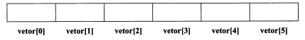
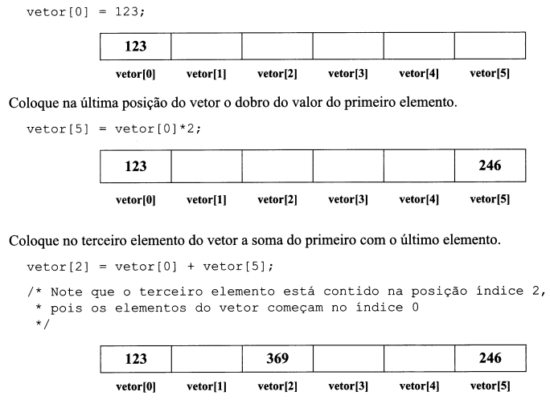
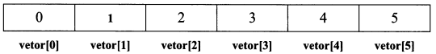
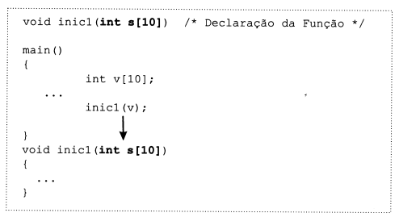
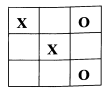
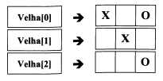
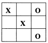

# Linguagem C

## Vectores

Depois de termos aprendido quais são os tipos básicos em C (char, int, float e double) e quais as estruturas de controle (if, switch, while, for e do...while), vamos agora estudar a forma como podemos processar conjuntos de dados/valores do mesmo tipo.

Um vector (também vulgarmente conhecido por **Array**), não é mais que um conjunto de elementos consecutivos, todos do mesmo tipo, que podem ser acessados individualmente a partir de um único nome.

## Declaração de Vectores

Um vector em C é declarado da mesma forma que uma variável simples.

    int n;      /* Declaração da variável */

A declaração de um vector com uma única dimensão obedece à seguinte sintaxe:

    tipo nome_variavel [ n° de elementos ]

- Tipo - corresponde ao tipo de dados de cada um dos elementos do vetor.
- Nome_Variável - indica o nome pelo qual esse vetor vai ser conhecido.
- N° de elementos - valor constante que indica quantos elementos tem o vetor.

Nota:

    Um vetor pode conter elementos de qualquer tipo de dados. No entanto, os elementos do vetor são todos do mesmo tipo, o qual é definido na declaração do mesmo.

Para declarar um vetor de 20 inteiros

    int g[20];      /* g é um vetor com 20 números inteiros */

Para declarar um vetor com 100 números reais

    float renda[100];       /* renda é um vetor com 100 números reais */

Todos os elementos de um vetor podem ser identificados pelo mesmo nome(*g* ou *renda*, nos exemplos anteriores), no entanto, para que se possa identificar cada um deles individualmente é necessário um número(índice) que indique qual a sua posição no vetor.

Numa declaração como

    float renda[100];       /* renda é um vetor com 100 números reais */

**float**       - Tipo de cada um dos elementos do vetor.
**100**         - N° de elemntos do vetor.
**renda**       - Nome do Vetor.
**rendi[i]**    - Aquilo que está na posição **i** do vetor **renda**.

Suponhamos, então, que pretendíamos declarar um vetor com seis números interios denominado **vetor**.

    int vetor[6];



Nota:

    Em C os índices de um vetor com n elementos variam sempre entre 0 e n-1.

Dessa forma, cada uma das seis posições do nosso vetor pode ser acessada atráves do respetivo índice colocado entre **Colchetes []**.

Nota:

    O índice do primeiro elemento, de qualquer vetor em C, é sempre 0 (ZERO).

**Exemplo:** Coloque o valor 123 na primeira posição do vetor:



Nota:

    Em um vetor o n-ésimo elemento está sempre na posição n-1.

A posição ocupada por um elemento de um vetor também é chamada de índice desse elemento no vetor.

Inicie novamente todo vetor, colocando em cada posição do memso o índice dessa mesma posição.

    for (i=0; i<6; i++)
        vetor[i] = i;



O índice de um elemento pode ser representado por qualquer expressão que devolva um valor inteiro.

    vetor[1] = 2;                   /* 1 é um inteiro */
    vetor[3 - 1] = 23;              /* equivalente a vetor[2] = 23 */
    vetor[1+vetor[1]] = 513;        /* equivalente a vetor[1+2] = 513 */
                                    /* pois vetor[1] contém um inteiro */

## Carga Inicial Automática de Vetores

Nota:

    Tal como as variáveis, os valores quando são criados contêm valores aleatórios (LIXO) em cada uma das suas posições.

É possível iniciar automaticamente todos os elementos de um vetor através da seguinte sintaxe:

    tipo var[n] = { valor1, valor2, ..., valor(n)};

**Exemplo:** Declare e inicie um vetor com todas as vogais do alfabeto.

    char vogal[5] = {'a', 'e', 'i', 'o', 'u'};

Evita-se, assim, escrever o seguinte conjunto de código:

    char vogal[5];
    vogal[0] = 'a';
    vogal[1] = 'e';
    vogal[2] = 'i';
    vogal[3] = 'o';
    vogal[4] = 'u';

Nota:

    Se um valor for declarado com n elementos e forem colocados apenas k valores (k < n) na carga inicial do vetor, então os primeiros k elementos do vetor serão iniciados com os respetivos valores e os restantes serão iniciados com o valor ZERO.

Suponhamos a seguinte declaração:

    int v[10] = {10, 20, 30};

No exemplo anterior, os três primeiros elementos do vetor (índice 0, 1, 2) ficam iniciados com os valores 10, 20 e 30, respetivamente, e todos os outros ficam iniciados com o valor 0;

Assim, as seguintes instruções são equivalentes

    int [10] = {10, 20, 30};
    int [10] = {10, 20, 30, 0, 0, 0, 0, 0, 0, 0};

Atensão:

    As posições de um vetor só são iniciadados se a declaração deste for seguida de = { valor ... valor};

**Exemplo:** Escreva um programa que realize a leitura dos salários pagos a um indivíduo durante um ano. Em seguida, o programa deverá mostrar os valores mensais e o total anual.

***prog0601.c***

```C
#include <stdio.h>

int main()
{
    float sal[12];  /* 12 meses */
    float total;
    int i;

    for (i=0; i<12; i++)
    {
        printf("Introd. o salário do mês %d: ", i+1);
        scanf("%f", &sal[i]);
    }

    /* Mostrar os valores Mensais e calcular o tatal */
    puts(" Mês      Valor ");
    for (i = 0, total = 0.0; i < 12; i++)
    {
        printf(" %3d       %9.2f\n", i+1, sal[i]);
        total+=sal[i];
    }

    printf("Total Anual: %9.2f\n", total);
}
```

Note que o usuário não tem que saber como os dados são armazenados no nosso programa. Assim, quando solicitarmos o primeiro mês (mês 1) temos que armazená-lo na posição 0 do vetor. Não faz qualquer sentido solicitar ao usuário a introdução do mês 0. Por isso é escrito o valor i+1 na tela e armazenado o valor na posição índice i do vetor.

    for (i=0; i<12; 1++>)
    {
        printf("Introd. o salário do mês %d:", i+1);
        scanf("%f", &sal[i]);
    }

O exemplo anterior pode provocar alguma confusão, porque estamos habituados a pensar nos meses do ano entre 1 e 12, e não entre 0 e 11.

Por isso, alguns programadores resolvem o problema de outra forma.

Declaram um vetor com 13 elementos (índices 0.. 12), de forma a poderem utilizar os índices relativos ao
mês pretendido (1... 12). O índice 0 é simplesmente ignorado.

***prog0602.c***

```C
#include <stdio.h>

int main()
{
    float sal[13];  /* indice 0+12 meses */
    float total;
    int i;

    for (i=1; i<=12 ; i++){
        printf("Introd. o salário do mês %d:",i);
        scanf("%f",&sal[i] ) ;
    }

    /* Mostrar os valores Mensais e calcular o total */
    puts(" Mês      Valor ");
    for (i=1, total=0.0 ; i<=12 ; i++)
    {
        printf(" %3d        %9.2f\n",i,sal[i]);
        total+=sal [i] ;
    }

    printf("Total       Anual: %9.2f\n",total);
}
```

A declaração e a carga inicial de um vetor podem ser realizadas sem indicar qual o número de elementos do vetor.

    tipo var[] = { valor1, valor2, ..., valor(n) };

Nesse caso, o compilador vai criar um vetor com tantos elementos quantas as cargas iniciais.


## Vetores - Exemplos de Declaração

    int v[10];                  /* Vetor com 10 elementos não iniciados */
    int v[3] = {5,10,15};       /* Vetor com 3 elementos automaticamente */
                                /* iniciados com os valores 5, 10 e 15 */
    int v[10] = {5,10,15};      /* Vetor com 10 elementos. Os três primeiros */
                                /* são iniciados com os valores 5, 10, 15 */
                                /* Os restantes são iniciados com 0 */
    int v[] = {5,10,15};        /* Vetor com 3 elementos iniciados com */
                                /* os valores 5, 10 e 15 */
                                /* Equivalente a int v[3] = {5,10,13} */
    int v[]                     /* Declaração incompleta    */
                                /* Provoca erro de compilação   */

## Algumas Notas sobre Vetores

- Os elementos de um vetor são sempre armazenados em posições **contínuas** de memória.
- Os elementos de um vetor declarado sem qualquer carga inicial contêm valores aleatórios.
- Os índice do primeiro elemento de um vetor é sempre 0 (ZERO).
- Os índices de um vetor com n elementos variam sempre entre **0** e **n-1**.
- O valor existente em uma posição do vetor **v** pode ser obtido através do índice em que essa posição está armazenada **v[índice]**.
- O compilador não verifica se os índices utilizados em um vetor estão ou não corretos. Um exemplo
comum de erro de manipulação de um vetor com n elementos é a utilização do índice n (v[n])> que
não pertence ao vetor e pode originar problemas graves, pois estaríamos alterando memória que
não nos pertence.
- O compilador não verifica se os índices utilizados num vetor estão ou não corretos com a declaração do vetor. Isto é, podemos declarar um vetor v com dimensão 3 e referenciar (erradamente) posições superiores ou inferiores, sem que o compilador indique qualquer erro.
- Um vetor pode ser automaticamente iniciado com o conjunto de valores existente dentro de chaves, após o sinal =. Isso apenas pode serfeito quando da declaração do vetor.
- Se o número de cargas iniciais for menor que o número de elementos do vetor, os elementos em falta são iniciados com o valor ZERO.
- Pode-se declarar um vetor sem indicar qual o número de elementos que ele irá conter, desde que estes sejam colocados na sua carga inicial. Nesse caso, o compilador calcula, automaticamente, o número de elementos que o vetor irá conter.
- Não se pode declarar vetores sem dimensão. Se não sabemos qual a dimensão pretendida, como poderá o compilador saber qual o espaço necessário?

## Passagem de Vetores para Funções

Suponhamos as seguintes declarações:

    int v[10];
    int x[20];

Suponhamos, então, que era nossa intenção iniciar os vetores **v** e **x** com o valor ZERO em todas as posições, e que pretendíamos utilizar uma função para realizar tal carga inicial.

Como os vetores têm diferentes, teremos eventualmente que definir duas funções distintas (uma para vetores com 10 inteiros, ooutra para vetores com 20 inteiros).

    void inic1 (int s[10])
    {
        int i;
        for (i=0; i<10; i++)
            s[i] = 0;
    }
    void inic2 (int s[20])
    {
        int i;
        for (i=0; i<20; i++)
            s[i] = 0;
    }

Temos, assim, o código de cada uma das funções.

A invocação dessas funções na *main* deverá ser realizada da seguinte forma:

    main()
    {
        int v[10];
        int x[20];

        inic1(v);   /* Iniciar o vetor v usando a função inic1 */
        inic2(x);   /* Iniciar o vetor v usando a função inic2 */
    }

Repare que se é enviado um vetor com 10 inteiros à função inic1, esta deverá ter um parâmetro do mesmo tipo da variável.



No entanto, as duas funções de carga inicial podem ser substituídas por uma única que inicie qualquer
vetor de inteiros com o valor 0. Isso é possível porque em C não interessa qual a dimensão do vetor que é
passado a uma função, mas sim qual o tipo dos seus elementos, e, nesse caso, ambos os vetores são constituídos por inteiros.

Nota:

    Em C, dentro de uma função não é possível saber com quantos elementos foi declarado um vetor que foi passado como argumento para essa função.

É possível escrever uma função que inicie qualquer vetor de inteiros. No entanto (por causa da nota anterior), é necessário indicar a essa função qual o número de elementos que o vetor cóntem.

```C

```

Note agora que a função **void inic(int s[] ,int n)** recebe um vetor de inteiros (sem indicar qual a sua dimensão) e um inteiro que indica qual o número de elementos a iniciar.

Dessa forma, é possível iniciar um vetor de inteiros (qualquer que seja a dimensão com que foi declarado), pois não é indicado no parâmetro da função qual o número de elementos que o vetor contém.

Nota:

    Se for indicada qual a dimensão do vetor no parâmetro da função, o número de elemento do vetor é simplesmente ignorado pelo compilador. A função apenas se interessa em saber qual o tipo dos elementos do vetor. A dimensão a considerar é de responsabilidade exclusiva do programador.

## Constantes

### Definição de Constantes

Uma constante não é mais que um nome correspondente a um valor fixo (não se pode alterar ao longo de uma execução).

Estas devem ser definidas, em principio, fora de qualquer função, de modo a serem visíveis ao longo de todo o programa.

Nota:

    As constantes devem ser declaradas fora das funções, de forma a serem "visíveis" por todo o código do programa. Normalmente a sua definição é realizada imediatamente após as linhas dos #includes.

A difição de constantes pode ser realizada de duas maneiras distintas:

- Através da palavra reservada **const**;

    const tipo símbolo = valor

- Através da diretiva de pré-processamento **#define**

    #define símbolo valor

**Exemplos:**

***prog0605.c***

```C
#include <stdio.h>

const int num = 10;

void inic(int s[])
{
    int i;
    for (i=0; i<num; i++)
        s[i]=0;
}

int main()
{
    int v[num], i;

    inic(v);

    for ( i = 0; i < num; i++)
        v[i] = i;

    for ( i = num-1; i >= 0; i--)
        printf ("%d\n", v[i]);
}
```

***prog0606.c***

```C
#include <stdio.h>

#define NUM 10          /* Sem Ponto-e-Vírgula */

void inic(int s[])
{
    int i;
    for (i=0; i<NUM; i++)
        s[i]=0;
}

int main()
{
    int v[NUM], i;

    inic(v);

    for ( i = 0; i < NUM; i++)
        v[i] = i;

    for ( i = NUM-1; i >= 0; i--)
        printf ("%d\n", v[i]);
}
```

Caso se pretenda alterar o programa de 10 para 25, bastará alterar a linha em que a constante está definida, independentemente do número de ocorrências desta ao longo do programa.

### Diferentes entre const e #define

entre const e #define
- Uma constante definida com const existefisicamente em uma determinada posição de memória.
- Uma constante definida com #define não existefisicamente em memória, sendo o seu valor substituído ao longo do programa na fase de pré-processamento (ainda antes da compilação).
- A palavra const faz parte das palavras reservadas da linguagem C.
- A palavra #define é uma diretiva que indica ao pré-processador que o símbolo que a segue vai ficar com o valor que aparece depois do símbolo. O pré-processador, antes de compilar o programa, substitui todas as ocorrências do 
símbolo pelo valor com que este foi definido. (No exemplo anterior, substitui todas as ocorrências de NUM por 10). E como se existisse um duende maroto que substituísse todas as ocorrências de NUM por 10, imediatamente antes da compilação
do programa.
- Uma constante definida com a palavra const fica com o tipo que lhe foi colocado na definição.
- O tipo associado a uma constante definida com #define é o tipo que resulta da expressão que aparece na componente valor.
- Uma vez que o símbolo #define nãofazparte da linguagem C, essa linha não é seguida de ponto-e-vírgula.

Nota:

    As constantes definidas com o símbolo #define chamam-se Constantes Simbólicas.

Nota:

    Embora não seja obrigatório, habitualmente os programadores de C colocam as constantes simbólicas em maiúsculas.

### Matrizes e Vetores Multidimensionais

Até o momento vios como podiamos trabalhar com vetores com uma única dimensão. Vamos agora aprender como se podem usar vetores com mais de uma dimensão.

Nota:

    Não existe qualquer limite para o número de dimensões que um vetor pode conter.

A declaração de vetores unidimensionais não é mais do que um caso particular da declarações de vetores com qualquer número de dimensões.

A declaração de um vetor com n dimensões é realizada através da seguinte sintaxe:

    tipo vetor[dim1] [dim2] [...] [dim(n)]

A título de exemplo, vamos observar como poderíamos implementar o famoso Jogo da Velha recorrendo a um vetor como tabuleiro do jogo.



Como se pode observar, necessitamos de um vetor de duas dimensões (que também vulgarmente se chama **Matriz**).

Cada quadricula vai conter X, um 0 ou um espaço em branco. Assim, trata-se de um vetor de caracteres.

A declaração deverá ser realizada do seguinte modo:

    #define DIM 3
    ....
    char Velha[DIM][DIM];   /* 3 Linhas, cada uma com 3 posições */

Nota:

    Em C, um vetor declaração com duas dimensões não é, na realidade, uma Matriz, mas sim um vetor de vetores. O mesmo se aplica a vetores com dimensão superior a 2.

No caso anterior aquilo que declaramos não foi uma matriz, mas sim um vetor de três posições Velha[3], em que cada uma dessas posições é forma por um vetor de três caracteres.



Assim:

**Velha**       -É um vetor de caracteres com duas dimensões 3x3.
**Velha[i]**    -É um vetor de três caracteres.
**Velha[i][j]** -Caractere presente na linha *i* e coluna *j* do vetor Velha.

Se declaramos um vetor

    int v[3][4];

**v**       -É um vetor com três elementos (cada elemento é um vetor de quatro inteiros)
**v[i]**    -É um vetor de quatro inteiros.
**v[i][j]** -É o inteiro que está colocado na posição *ij* do vetor *v*.

### Vetores Multidimensionais: Carga Inicial Automática

A carga inicial deve ser realizada da mesma forma que os vetores de uma dimensão.

Suponhamos, então, que desejámos iniciar o nosso jogo da velha com espaços em todas as posições;

    char Velha [DIM][DIM] = {' ',' ', ' ' ,' ' ,' ', ' ', ' ', ' ', ' ', ' ', ' ',' '};

Embora essa seja a forma tradicional de carga inicial do vetor, ela não está correta, pois Velha não é um vetor de 12 elementos, mas sim um vetor constituído por três vetores.

A carga inicial de um vetor de uma dimensão com três espaços é realizada do seguinte modo:

    char v[3] = {' ',' ',' '};

Ora, como a carga inicial de um vetor com três elementos (cada um dos quais também é um vetor), teremos então que colocar entre as chaves apenas três elementos:

    char Velha[DIM][DIM] = { , , };

O problema agora é saber que elementos colocar.

**Pergunta:** O que corresponde a Velha[0]?
**Resposta:** Velha[0] é um vetor com três caracteres.
**Pergunta:**   Como é que se inicia um vetor de três caracteres com espaços?
**Resposta:** Colocando os respectivos caracteres entre chaves {' ',' ',' '}

já sabemos, então, como iniciar o primeiro elemento do vetor.

    char Veha[DIM][DIM] = { {' ',' ',' '}, , };

Os outros são iniciados da mesma forma.

Assim, a carga inicial do vetor velha pode ser realizada de duas maneiras distintas:

    char Velha [DIM][DIM] = {' ',' ', ' ' ,' ' ,' ', ' ', ' ', ' ', ' ', ' ', ' ',' '};

ou

    char Velha[DIM][DIM] = { {' ',' ', ' '}, {' ', ' ',' '}, {' ',' ',' '} };

**Exemplo:** Declare e inicie o vetor de inteiros v[2][4] com valores inteiros a seu gosto.

    int v[2][4] = {{1,2,3,4}, {5,6,7,8,}};

Nota:

    Os índices de cada dimensão de um vetor começam sempre no valor 0 (ZERO).

**Exercício:**

Escreva um programa que coloque o tabuleiro do jogo da velha neste estado, depois de ter sido iniciado com espaços durante a declaração do mesmo.



Em seguida mostre o tabuleiro na tela.

```C
#include <stdio.h>

#define DIM 3

int main()
{
    char vetor[DIM][DIM];
    int i, j;

    for (i = 0; i < DIM; i++)
        for (j = 0; j < j; j++)    
            vetor[i][j] = ' ';

    vetor[0][0] = 'X';
    vetor[0][2] = 'O';
    vetor[1][1] = 'X';
    vetor[2][2] = 'O';

    for (i = 0; i < DIM; i++)
    {
        printf("|");
        for ( j = 0; j < DIM; j++)
            printf ("%c\t|", vetor[i][j]);  

        printf("\n");
        if (DIM-1 != i)
            printf("-------------------------\n");
    }
}
```

Na carga inicial automática de um vetor pode-se omitir apenas um valor numérico para a dimensão mais à esquerda, sendo o respectivo valor calculado pelo compilador.

    char Velha [][] = { {' ', ' ', ' '}, {' ',' ',' '}, {' ',' ',' '} };     /* Erro */
    char Velha [][3] = { {' ', ' ', ' '}, {' ',' ',' '}, {' ',' ',' '} };

equivalente a

    char Velha [][] = { {' ', ' ', ' '}, {' ',' ',' '}, {' ',' ',' '} };

### Vetores Multidimensionais: Passagem para Funções

A passagem de vetores com mais de uma dimensão para uma função é realizada indicando no cabeçalho
desta, obrigatoriamente, o número de elementos de cada uma das n-1 dimensões à direita. Apenas a di-
mensão mais à esquerda pode ser omitida, colocando-se apenas **[ ]** ou um asterisco **\*** .

É, no entanto, habitual colocar todas as dimensões dos vetores.

***prog0607.c***

```C
#include <stdio.h>

#define DIM 3
#define ESPACO 'E'
#define DOIS 2

void inic(char array[][DIM])
{
    short int i, j;

    i = 0;
    while (i < DIM)
    {
        j = 0;
        while (j < DIM)
        {
            array[i][j] = ESPACO;
            j++;
        }
        i++;
    }
}

void mostra(char array[DIM][DIM])
{
    short int i, j;
    i = 0;
    while (i < DIM)
    {
        j = 0;
        while (j < DIM)
        {
            printf("%c%c", array[i][j], ((j == DIM-1) ? '\n' : '\t'));
            j++;
        }
        i++;
    }
}

int main()
{
    char array[DIM][DIM];
    short int i, j;
    short int posx, posy;
    short int n_jogadas = 1;

    inic(array);
    while (1)
    {
        printf("Sendo que temos uma matriz, selecione a área para poder jogar: ");
        scanf("%hd%hd", &posx, &posy);
        getchar();

        if (array[posx][posy] != ESPACO)
        {
            printf("Posição já ocupada, tente novamente.\n");
            continue;
        }
        
        array[posx][posy] = ((n_jogadas % DOIS) == 0 ? 'O' : 'X');

        mostra(array);
        if (n_jogadas == (DIM*DIM))
            break;
        n_jogadas++;
    }
}
```

Atenção:

    O próximo capítulo - Strings - aborda novamente o conceito de vetor, nesse caso um tipo especial de vetores de caracteres.

Nota:

    Alguns dos exercícios resolvidos e propostos implementam algumas funções (memset, memcpy, mencmp e memlcmp). Essas funções fazem pare da biblioteca standard de funções da linguagem C, e para ter acesso a elas bastará que se faça #include <mem.h> no início do programa ou arquivo.


